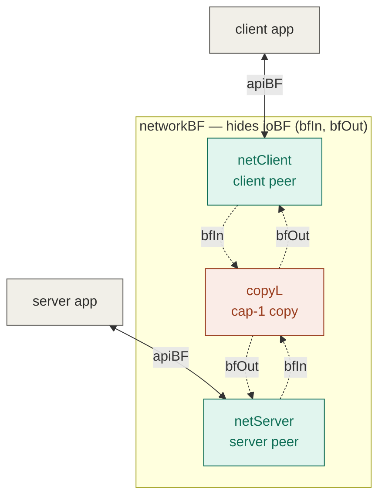
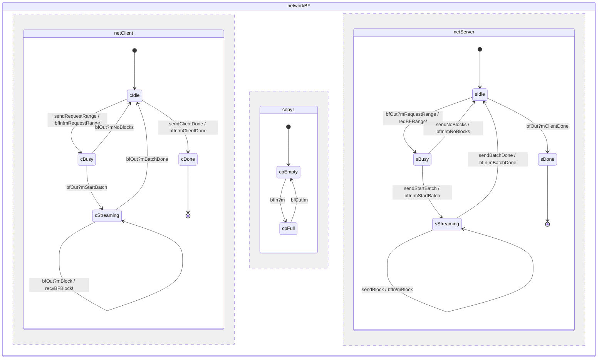
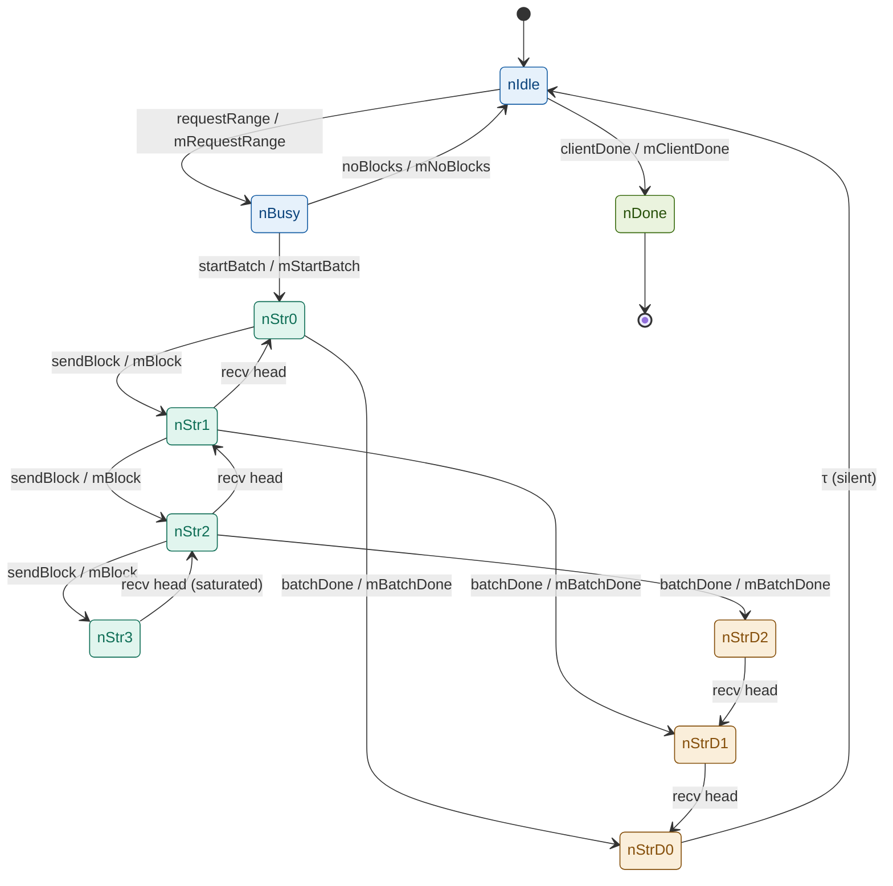

```agda
{-# OPTIONS --guardedness #-}
```

```agda
------------------------------------------------------------------------
-- Cardano network example — the BlockFetch mini-protocol peers.
--
-- The BlockFetch peers are written over their own small event type
-- `BFEv`, then (at the composition step, `BlockFetchNetworkPar`) renamed
-- into the shared network alphabet `Net_Api Payload`.  This mirrors
-- `KeepAlive.agda`: wire events `sendBF`/`receiveBF` negotiate `Payload`;
-- the application-facing api/done events are peer-local and hidden before
-- any rename.  Both peers are productive (no NON_TERMINATING): each is a
-- non-recursive step function tied with `iter`.
--
-- Protocol: the client requests a block range; the server streams blocks.
--   Client stIdle     : api RequestRange ⇒ send MsgRequestRange ⇒ stBusy
--                     | api ClientDone  ⇒ send MsgClientDone   ⇒ stDone
--          stBusy    : recv MsgStartBatch ⇒ stStreaming | recv MsgNoBlocks ⇒ stIdle
--          stStreaming: recv MsgBlock b ⇒ deliver (recvBFBlock b) ⇒ stStreaming
--                     | recv MsgBatchDone ⇒ stIdle
--   Server stIdle     : recv MsgRequestRange r ⇒ notify (reqBFRange r) ⇒ stBusy
--                     | recv MsgClientDone ⇒ stDone
--          stBusy    : api StartBatch ⇒ send MsgStartBatch ⇒ stStreaming
--                     | api NoBlocks  ⇒ send MsgNoBlocks   ⇒ stIdle
--          stStreaming: api Block b ⇒ send MsgBlock b ⇒ stStreaming
--                     | api BatchDone ⇒ send MsgBatchDone ⇒ stIdle
-- 
------------------------------------------------------------------------
```

State machine diagram

      ┌────────┐                                       ┌────────┐
start │ StIdle │         MsgClientDone                 │ StDone │
────► │        │ ──────────────────────────────────►   │        │
      └────────┘                                       └────────┘
       │   ▲  ▲
       │   │  │
       │   │  └─────────────── MsgBatchDone ──────────────┐
       │   │                                              │
       │   └──────── MsgNoBlocks ───────┐                 │
       │                                │                 │
  MsgRequestRange                       │                 │
       │                                │                 │
       ▼                                │                 │
      ┌────────┐                        │           ┌─────────────┐
      │ StBusy │ ───────────────────────┘           │ StStreaming │ ◄─┐
      │        │                                    │             │   │ MsgBlock
      │        │ ────── MsgStartBatch ─────────────►│             │ ──┘
      └────────┘                                    └─────────────┘
      

# Imports

```agda
open import CSP.Examples.Cardano_network.Params using (Params)

module CSP.Examples.Cardano_network.BlockFetch (p : Params) where

open import Level renaming (zero to lzero)
import Data.Unit.Polymorphic as Poly
open import Data.Unit using (⊤)
open import Data.Empty using (⊥)
open import Data.Product using (_×_; _,_)
open import Data.Maybe using (Maybe; just; nothing)
open import Data.Sum using (_⊎_; inj₁; inj₂)
open import Relation.Nullary using (Dec; yes; no)
open import Relation.Binary.PropositionalEquality using (_≡_; refl)
open import Class.DecEq using (DecEq; _≟_)

open import Process_Trees

open import CSP.Examples.Cardano_network.Base
open import CSP.Examples.Cardano_network.Data p
open import CSP.Examples.Cardano_network.Net  p

open Params p
```

```agda
------------------------------------------------------------------------
-- Step 1: the per-protocol event type `BFEv`.
--
-- Network events negotiate `Payload`; the application-facing api/done
-- events are peer-local (`apiBFev` carries `ApiBFCar m`; `doneBF` is `⊤`).
------------------------------------------------------------------------

-- the BlockFetch peer alphabet
data BFEv : Set → Set where
  sendBF    : Link → Dir → BFEv Payload   -- peer→net (→ input);  emitted via !
  receiveBF : Link → Dir → BFEv Payload   -- net→peer (→ output); bound via ?
  apiBFev   : (l : Link) (d : Dir) (m : ApiBFTag) → BFEv (ApiBFCar m)  -- peer-local
  doneBF    : Link → Dir → BFEv ⊤          -- peer-local: Done

------------------------------------------------------------------------
-- Step 2: decidable equality on `AnyTypes BFEv`.
------------------------------------------------------------------------

-- decidable equality on existential-wrapped BlockFetch events
BFEv-≟ : (x y : AnyTypes BFEv) → Dec (x ≡ y)
BFEv-≟ = go
  where
  go : (x y : AnyTypes BFEv) → Dec (x ≡ y)
  go (_ , sendBF l₁ d₁)     (_ , sendBF l₂ d₂)     with l₁ ≟ l₂ | d₁ ≟ d₂
  ... | yes refl | yes refl = yes refl
  ... | no ¬p    | _        = no λ where refl → ¬p refl
  ... | _        | no ¬p    = no λ where refl → ¬p refl
  go (_ , receiveBF l₁ d₁)  (_ , receiveBF l₂ d₂)  with l₁ ≟ l₂ | d₁ ≟ d₂
  ... | yes refl | yes refl = yes refl
  ... | no ¬p    | _        = no λ where refl → ¬p refl
  ... | _        | no ¬p    = no λ where refl → ¬p refl
  go (_ , apiBFev l₁ d₁ m₁) (_ , apiBFev l₂ d₂ m₂) with l₁ ≟ l₂ | d₁ ≟ d₂ | m₁ ≟ m₂
  ... | yes refl | yes refl | yes refl = yes refl
  ... | no ¬p | _ | _ = no λ where refl → ¬p refl
  ... | _ | no ¬p | _ = no λ where refl → ¬p refl
  ... | _ | _ | no ¬p = no λ where refl → ¬p refl
  go (_ , doneBF l₁ d₁)     (_ , doneBF l₂ d₂)     with l₁ ≟ l₂ | d₁ ≟ d₂
  ... | yes refl | yes refl = yes refl
  ... | no ¬p    | _        = no λ where refl → ¬p refl
  ... | _        | no ¬p    = no λ where refl → ¬p refl
  go (_ , sendBF _ _)    (_ , receiveBF _ _) = no λ ()
  go (_ , sendBF _ _)    (_ , apiBFev _ _ _) = no λ ()
  go (_ , sendBF _ _)    (_ , doneBF _ _)    = no λ ()
  go (_ , receiveBF _ _) (_ , sendBF _ _)    = no λ ()
  go (_ , receiveBF _ _) (_ , apiBFev _ _ _) = no λ ()
  go (_ , receiveBF _ _) (_ , doneBF _ _)    = no λ ()
  go (_ , apiBFev _ _ _) (_ , sendBF _ _)    = no λ ()
  go (_ , apiBFev _ _ _) (_ , receiveBF _ _) = no λ ()
  go (_ , apiBFev _ _ _) (_ , doneBF _ _)    = no λ ()
  go (_ , doneBF _ _)    (_ , sendBF _ _)    = no λ ()
  go (_ , doneBF _ _)    (_ , receiveBF _ _) = no λ ()
  go (_ , doneBF _ _)    (_ , apiBFev _ _ _) = no λ ()

------------------------------------------------------------------------
-- Step 3: peer return type and its DecEq.
------------------------------------------------------------------------

-- the peers return the unit on √
Rr : Set
Rr = Poly.⊤ {lzero}

instance
  -- trivial decidable equality on the unit return type
  DecEq-Rr : DecEq Rr
  DecEq-Rr = record { _≟_ = λ _ _ → yes refl }

------------------------------------------------------------------------
-- CSP operators over the small BlockFetch alphabet.
------------------------------------------------------------------------

import CSP.Operators {E = BFEv} as BFOps
open BFOps BFEv-≟

------------------------------------------------------------------------
-- Step 4: the client (initiator) peer.
------------------------------------------------------------------------

-- unified BlockFetch peer state (both peers walk the same FSM; agency differs).
data BFState : Set where
  stIdle      : BFState   -- Idle: client offers the api / server awaits a request
  stBusy      : BFState   -- Busy: awaiting StartBatch / NoBlocks (client) or offering it (server)
  stStreaming : BFState   -- Streaming: the block batch
  stDone      : BFState   -- terminal (√)

instance
  -- decidable equality on the unified BlockFetch state
  DecEq-BFState : DecEq BFState
  DecEq-BFState ._≟_ = go
    where
    go : (x y : BFState) → Dec (x ≡ y)
    go stIdle      stIdle      = yes refl
    go stBusy      stBusy      = yes refl
    go stStreaming stStreaming = yes refl
    go stDone      stDone      = yes refl
    go stIdle      stBusy      = no λ ()
    go stIdle      stStreaming = no λ ()
    go stIdle      stDone      = no λ ()
    go stBusy      stIdle      = no λ ()
    go stBusy      stStreaming = no λ ()
    go stBusy      stDone      = no λ ()
    go stStreaming stIdle      = no λ ()
    go stStreaming stBusy      = no λ ()
    go stStreaming stDone      = no λ ()
    go stDone      stIdle      = no λ ()
    go stDone      stBusy      = no λ ()
    go stDone      stStreaming = no λ ()

-- one client step (the body of the `iter` loop)
clientStep : Link → Dir → BFState → PTree BFEv (ExtI BFEv) (BFState ⊎ Rr)
clientStep l d stIdle = pchoice v
  where
  v : (at : AnyTypes BFEv)
    → ContinueType at (Maybe (PTree BFEv (ExtI BFEv) (BFState ⊎ Rr)))
  v (_ , apiBFev l′ d′ sendBFRequestRange) range with l′ ≟ l | d′ ≟ d
  ... | yes refl | yes refl = just
        (sendBF l d ! (time₀ , FromInitiator , length₀ , blockFetch (MsgRequestRange range)) ⟶
           Ret (inj₁ stBusy))
  ... | _        | _        = nothing
  v (_ , apiBFev l′ d′ sendBFClientDone) _ with l′ ≟ l | d′ ≟ d
  ... | yes refl | yes refl = just
        (sendBF l d ! (time₀ , FromInitiator , length₀ , blockFetch MsgClientDone) ⟶
           (doneBF l d ⟶₀ Ret (inj₁ stDone)))
  ... | _        | _        = nothing
  v (_ , apiBFev _ _ _) _ = nothing
  v (_ , sendBF _ _)    _ = nothing
  v (_ , receiveBF _ _) _ = nothing
  v (_ , doneBF _ _)    _ = nothing
clientStep l d stBusy = pchoice v
  where
  v : (at : AnyTypes BFEv)
    → ContinueType at (Maybe (PTree BFEv (ExtI BFEv) (BFState ⊎ Rr)))
  v (_ , receiveBF l′ d′) (_ , _ , _ , blockFetch MsgStartBatch) with l′ ≟ l | d′ ≟ d
  ... | yes refl | yes refl = just (Ret (inj₁ stStreaming))
  ... | _        | _        = nothing
  v (_ , receiveBF l′ d′) (_ , _ , _ , blockFetch MsgNoBlocks) with l′ ≟ l | d′ ≟ d
  ... | yes refl | yes refl = just (Ret (inj₁ stIdle))
  ... | _        | _        = nothing
  v (_ , receiveBF _ _) _ = nothing
  v (_ , sendBF _ _)    _ = nothing
  v (_ , apiBFev _ _ _) _ = nothing
  v (_ , doneBF _ _)    _ = nothing
clientStep l d stStreaming = pchoice v
  where
  v : (at : AnyTypes BFEv)
    → ContinueType at (Maybe (PTree BFEv (ExtI BFEv) (BFState ⊎ Rr)))
  v (_ , receiveBF l′ d′) (_ , _ , _ , blockFetch (MsgBlock b)) with l′ ≟ l | d′ ≟ d
  ... | yes refl | yes refl = just (apiBFev l d recvBFBlock ! b ⟶ Ret (inj₁ stStreaming))
  ... | _        | _        = nothing
  v (_ , receiveBF l′ d′) (_ , _ , _ , blockFetch MsgBatchDone) with l′ ≟ l | d′ ≟ d
  ... | yes refl | yes refl = just (Ret (inj₁ stIdle))
  ... | _        | _        = nothing
  v (_ , receiveBF _ _) _ = nothing
  v (_ , sendBF _ _)    _ = nothing
  v (_ , apiBFev _ _ _) _ = nothing
  v (_ , doneBF _ _)    _ = nothing
-- Done: successful termination (√)
clientStep _ _ stDone = Ret (inj₂ _)

-- the client peer: loop the step from the idle state
BFclientStClient : Link → Dir → PTree BFEv (ExtI BFEv) Rr
BFclientStClient l d = iter (clientStep l d) stIdle

------------------------------------------------------------------------
-- Step 5: the server (responder) peer — application-driven.
------------------------------------------------------------------------

-- one server step (the body of the `iter` loop)
serverStep : Link → Dir → BFState → PTree BFEv (ExtI BFEv) (BFState ⊎ Rr)
serverStep l d stIdle = pchoice v
  where
  v : (at : AnyTypes BFEv)
    → ContinueType at (Maybe (PTree BFEv (ExtI BFEv) (BFState ⊎ Rr)))
  v (_ , receiveBF l′ d′) (_ , _ , _ , blockFetch (MsgRequestRange range)) with l′ ≟ l | d′ ≟ d
  ... | yes refl | yes refl = just (apiBFev l d reqBFRange ! range ⟶ Ret (inj₁ stBusy))
  ... | _        | _        = nothing
  v (_ , receiveBF l′ d′) (_ , _ , _ , blockFetch MsgClientDone) with l′ ≟ l | d′ ≟ d
  ... | yes refl | yes refl = just (doneBF l d ⟶₀ Ret (inj₁ stDone))
  ... | _        | _        = nothing
  v (_ , receiveBF _ _) _ = nothing
  v (_ , sendBF _ _)    _ = nothing
  v (_ , apiBFev _ _ _) _ = nothing
  v (_ , doneBF _ _)    _ = nothing
serverStep l d stBusy = pchoice v
  where
  v : (at : AnyTypes BFEv)
    → ContinueType at (Maybe (PTree BFEv (ExtI BFEv) (BFState ⊎ Rr)))
  v (_ , apiBFev l′ d′ sendBFStartBatch) _ with l′ ≟ l | d′ ≟ d
  ... | yes refl | yes refl = just
        (sendBF l d ! (time₀ , FromResponder , length₀ , blockFetch MsgStartBatch) ⟶
           Ret (inj₁ stStreaming))
  ... | _        | _        = nothing
  v (_ , apiBFev l′ d′ sendBFNoBlocks) _ with l′ ≟ l | d′ ≟ d
  ... | yes refl | yes refl = just
        (sendBF l d ! (time₀ , FromResponder , length₀ , blockFetch MsgNoBlocks) ⟶
           Ret (inj₁ stIdle))
  ... | _        | _        = nothing
  v (_ , apiBFev _ _ _) _ = nothing
  v (_ , sendBF _ _)    _ = nothing
  v (_ , receiveBF _ _) _ = nothing
  v (_ , doneBF _ _)    _ = nothing
serverStep l d stStreaming = pchoice v
  where
  v : (at : AnyTypes BFEv)
    → ContinueType at (Maybe (PTree BFEv (ExtI BFEv) (BFState ⊎ Rr)))
  v (_ , apiBFev l′ d′ sendBFBlock) b with l′ ≟ l | d′ ≟ d
  ... | yes refl | yes refl = just
        (sendBF l d ! (time₀ , FromResponder , length₀ , blockFetch (MsgBlock b)) ⟶
           Ret (inj₁ stStreaming))
  ... | _        | _        = nothing
  v (_ , apiBFev l′ d′ sendBFBatchDone) _ with l′ ≟ l | d′ ≟ d
  ... | yes refl | yes refl = just
        (sendBF l d ! (time₀ , FromResponder , length₀ , blockFetch MsgBatchDone) ⟶
           Ret (inj₁ stIdle))
  ... | _        | _        = nothing
  v (_ , apiBFev _ _ _) _ = nothing
  v (_ , sendBF _ _)    _ = nothing
  v (_ , receiveBF _ _) _ = nothing
  v (_ , doneBF _ _)    _ = nothing
-- Done: successful termination (√)
serverStep _ _ stDone = Ret (inj₂ _)

-- the server peer: loop the step from the idle state
BFserverStClient : Link → Dir → PTree BFEv (ExtI BFEv) Rr
BFserverStClient l d = iter (serverStep l d) stIdle

------------------------------------------------------------------------
-- Step 6: network-fragment injection into `Net` (documentation stub).
--
-- As for KeepAlive, a *total* `ι : BFEv A → Net Payload A` is impossible
-- while api/done have no `Net` image.  This `Maybe`-valued helper records
-- the intended images of the *network* events only; api/done are `nothing`
-- (peer-local, hidden before any real rename).  The total `ι` and the
-- `renameMap`/`Par` composition are built in `BlockFetchNetworkPar`.
------------------------------------------------------------------------

-- intended Net images of the BlockFetch wire events (api/done: none)
ιBFNet : ∀ {A} → BFEv A → Maybe (Net Payload A)
ιBFNet (sendBF l d)    = just (input  l d N2N_BlockFetch)
ιBFNet (receiveBF l d) = just (output l d N2N_BlockFetch)
ιBFNet (apiBFev _ _ _) = nothing
ιBFNet (doneBF _ _)    = nothing
```

## Abstract BlockFetch process (from the state-machine diagram)

An *abstract* rendering of the BlockFetch protocol as a single CSP process —
the state machine itself, with no agency (client/server) split and no
connection index. Each protocol message becomes a CSP **channel** whose
carried value is exactly that message's payload: `MsgRequestRange` carries a
`ChainRange`, `MsgBlock` carries a `Block`, and the four control messages
carry `⊤`. At each state the process offers — by external choice, via
`pchoice` — the messages enabled there, and transitions per the diagram:

- `stIdle` — `MsgRequestRange r` ⇒ `stBusy` &nbsp;|&nbsp; `MsgClientDone` ⇒ `stDone`
- `stBusy` — `MsgStartBatch` ⇒ `stStreaming` &nbsp;|&nbsp; `MsgNoBlocks` ⇒ `stIdle`
- `stStreaming` — `MsgBlock b` ⇒ `stStreaming` &nbsp;|&nbsp; `MsgBatchDone` ⇒ `stIdle`
- `stDone` — √ (successful termination)

(Channel-agnostic on purpose. To make it network-facing, give each
constructor `(l : Link) (d : Dir)` parameters as in `BFEv`.)

```agda
-- the abstract BlockFetch alphabet: one channel per protocol message (carrying
-- that message's payload), PLUS the application-facing API events `apiBF m`
-- (carrier `ApiBFCar m`, reused from `Net p`).  The MESSAGES are hidden in the
-- network version; the API events stay OBSERVABLE and drive the refinement check.
data BFAbsEv : Set → Set where
  -- wire messages (to be hidden later)
  MsgRequestRange : BFAbsEv ChainRange
  MsgStartBatch   : BFAbsEv ⊤
  MsgNoBlocks     : BFAbsEv ⊤
  MsgBlock        : BFAbsEv Block
  MsgBatchDone    : BFAbsEv ⊤
  MsgClientDone   : BFAbsEv ⊤
  -- application-facing API events (observable)
  apiBF           : (m : ApiBFTag) → BFAbsEv (ApiBFCar m)

-- decidable equality on existential-wrapped abstract events (each constructor
-- is nullary, so equal constructors are equal by `refl`).
BFAbsEv-≟ : (x y : AnyTypes BFAbsEv) → Dec (x ≡ y)
BFAbsEv-≟ (_ , MsgRequestRange) (_ , MsgRequestRange) = yes refl
BFAbsEv-≟ (_ , MsgStartBatch)   (_ , MsgStartBatch)   = yes refl
BFAbsEv-≟ (_ , MsgNoBlocks)     (_ , MsgNoBlocks)     = yes refl
BFAbsEv-≟ (_ , MsgBlock)        (_ , MsgBlock)        = yes refl
BFAbsEv-≟ (_ , MsgBatchDone)    (_ , MsgBatchDone)    = yes refl
BFAbsEv-≟ (_ , MsgClientDone)   (_ , MsgClientDone)   = yes refl
BFAbsEv-≟ (_ , MsgRequestRange) (_ , MsgStartBatch)   = no λ ()
BFAbsEv-≟ (_ , MsgRequestRange) (_ , MsgNoBlocks)     = no λ ()
BFAbsEv-≟ (_ , MsgRequestRange) (_ , MsgBlock)        = no λ ()
BFAbsEv-≟ (_ , MsgRequestRange) (_ , MsgBatchDone)    = no λ ()
BFAbsEv-≟ (_ , MsgRequestRange) (_ , MsgClientDone)   = no λ ()
BFAbsEv-≟ (_ , MsgStartBatch)   (_ , MsgRequestRange) = no λ ()
BFAbsEv-≟ (_ , MsgStartBatch)   (_ , MsgNoBlocks)     = no λ ()
BFAbsEv-≟ (_ , MsgStartBatch)   (_ , MsgBlock)        = no λ ()
BFAbsEv-≟ (_ , MsgStartBatch)   (_ , MsgBatchDone)    = no λ ()
BFAbsEv-≟ (_ , MsgStartBatch)   (_ , MsgClientDone)   = no λ ()
BFAbsEv-≟ (_ , MsgNoBlocks)     (_ , MsgRequestRange) = no λ ()
BFAbsEv-≟ (_ , MsgNoBlocks)     (_ , MsgStartBatch)   = no λ ()
BFAbsEv-≟ (_ , MsgNoBlocks)     (_ , MsgBlock)        = no λ ()
BFAbsEv-≟ (_ , MsgNoBlocks)     (_ , MsgBatchDone)    = no λ ()
BFAbsEv-≟ (_ , MsgNoBlocks)     (_ , MsgClientDone)   = no λ ()
BFAbsEv-≟ (_ , MsgBlock)        (_ , MsgRequestRange) = no λ ()
BFAbsEv-≟ (_ , MsgBlock)        (_ , MsgStartBatch)   = no λ ()
BFAbsEv-≟ (_ , MsgBlock)        (_ , MsgNoBlocks)     = no λ ()
BFAbsEv-≟ (_ , MsgBlock)        (_ , MsgBatchDone)    = no λ ()
BFAbsEv-≟ (_ , MsgBlock)        (_ , MsgClientDone)   = no λ ()
BFAbsEv-≟ (_ , MsgBatchDone)    (_ , MsgRequestRange) = no λ ()
BFAbsEv-≟ (_ , MsgBatchDone)    (_ , MsgStartBatch)   = no λ ()
BFAbsEv-≟ (_ , MsgBatchDone)    (_ , MsgNoBlocks)     = no λ ()
BFAbsEv-≟ (_ , MsgBatchDone)    (_ , MsgBlock)        = no λ ()
BFAbsEv-≟ (_ , MsgBatchDone)    (_ , MsgClientDone)   = no λ ()
BFAbsEv-≟ (_ , MsgClientDone)   (_ , MsgRequestRange) = no λ ()
BFAbsEv-≟ (_ , MsgClientDone)   (_ , MsgStartBatch)   = no λ ()
BFAbsEv-≟ (_ , MsgClientDone)   (_ , MsgNoBlocks)     = no λ ()
BFAbsEv-≟ (_ , MsgClientDone)   (_ , MsgBlock)        = no λ ()
BFAbsEv-≟ (_ , MsgClientDone)   (_ , MsgBatchDone)    = no λ ()
-- API ↔ API: equal iff the tags agree (`_≟_` on `ApiBFTag`, from `Net p`).
BFAbsEv-≟ (_ , apiBF m₁) (_ , apiBF m₂) with m₁ ≟ m₂
... | yes refl = yes refl
... | no ¬p    = no λ where refl → ¬p refl
-- API vs message (and vice versa): always distinct constructors.
BFAbsEv-≟ (_ , apiBF _)         (_ , MsgRequestRange) = no λ ()
BFAbsEv-≟ (_ , apiBF _)         (_ , MsgStartBatch)   = no λ ()
BFAbsEv-≟ (_ , apiBF _)         (_ , MsgNoBlocks)     = no λ ()
BFAbsEv-≟ (_ , apiBF _)         (_ , MsgBlock)        = no λ ()
BFAbsEv-≟ (_ , apiBF _)         (_ , MsgBatchDone)    = no λ ()
BFAbsEv-≟ (_ , apiBF _)         (_ , MsgClientDone)   = no λ ()
BFAbsEv-≟ (_ , MsgRequestRange) (_ , apiBF _)         = no λ ()
BFAbsEv-≟ (_ , MsgStartBatch)   (_ , apiBF _)         = no λ ()
BFAbsEv-≟ (_ , MsgNoBlocks)     (_ , apiBF _)         = no λ ()
BFAbsEv-≟ (_ , MsgBlock)        (_ , apiBF _)         = no λ ()
BFAbsEv-≟ (_ , MsgBatchDone)    (_ , apiBF _)         = no λ ()
BFAbsEv-≟ (_ , MsgClientDone)   (_ , apiBF _)         = no λ ()

-- CSP operators over the abstract alphabet, kept QUALIFIED (`AbsOps.…`) so the
-- peer-level `open BFOps BFEv-≟` above is not shadowed.
import CSP.Operators {E = BFAbsEv} as BFAbsOps
module AbsOps = BFAbsOps BFAbsEv-≟

-- one step of the abstract SPEC: the application drives via an API event
-- (the `pchoice` key), the wire message follows, and any delivery API fires
-- after.  Hiding the messages later leaves exactly the observable API protocol.
absStep : BFState → PTree BFAbsEv (ExtI BFAbsEv) (BFState ⊎ Rr)
absStep stIdle = AbsOps.pchoice v
  where
  v : (at : AnyTypes BFAbsEv)
    → ContinueType at (Maybe (PTree BFAbsEv (ExtI BFAbsEv) (BFState ⊎ Rr)))
  v (_ , apiBF sendBFRequestRange) range =                   -- range in (env) ⇒ Msg!range ⇒ notify!range ⇒ Busy
    just (AbsOps.Output MsgRequestRange range
            (AbsOps.Output (apiBF reqBFRange) range (AbsOps.Ret (inj₁ stBusy))))
  v (_ , apiBF sendBFClientDone)   _ =                       -- client done: app ⇒ Msg ⇒ Done
    just (AbsOps.Prefix₀ MsgClientDone (AbsOps.Ret (inj₁ stDone)))
  v _ _ = nothing
absStep stBusy = AbsOps.pchoice v
  where
  v : (at : AnyTypes BFAbsEv)
    → ContinueType at (Maybe (PTree BFAbsEv (ExtI BFAbsEv) (BFState ⊎ Rr)))
  v (_ , apiBF sendBFStartBatch) _ =                         -- start batch: app ⇒ Msg ⇒ Streaming
    just (AbsOps.Prefix₀ MsgStartBatch (AbsOps.Ret (inj₁ stStreaming)))
  v (_ , apiBF sendBFNoBlocks)   _ =                         -- no blocks:  app ⇒ Msg ⇒ Idle
    just (AbsOps.Prefix₀ MsgNoBlocks (AbsOps.Ret (inj₁ stIdle)))
  v _ _ = nothing
absStep stStreaming = AbsOps.pchoice v
  where
  v : (at : AnyTypes BFAbsEv)
    → ContinueType at (Maybe (PTree BFAbsEv (ExtI BFAbsEv) (BFState ⊎ Rr)))
  v (_ , apiBF sendBFBlock) b =                              -- block in (env) ⇒ Msg!b ⇒ deliver!b ⇒ Streaming
    just (AbsOps.Output MsgBlock b
            (AbsOps.Output (apiBF recvBFBlock) b (AbsOps.Ret (inj₁ stStreaming))))
  v (_ , apiBF sendBFBatchDone) _ =                          -- batch done: app ⇒ Msg ⇒ Idle
    just (AbsOps.Prefix₀ MsgBatchDone (AbsOps.Ret (inj₁ stIdle)))
  v _ _ = nothing
-- Done: successful termination (√)
absStep stDone = AbsOps.Ret (inj₂ _)

-- the abstract BlockFetch process: loop the step from the idle state.
BFabstract : PTree BFAbsEv (ExtI BFAbsEv) Rr
BFabstract = AbsOps.iter absStep stIdle
```

## Pipelined abstract spec (matches the distributed impl's streaming)

The serial `BFabstract` above is too strict: it forces each `MsgBlock b` to be
delivered (`recvBFBlock b`) before the next block may be sent. The distributed
`clientServerBF` instead **pipelines** the streaming phase — the server may
accept/emit a second block before the client delivers the first — a capacity-2
FIFO whose reachable joint streaming states are exactly:

- `pStr0`     ↔ `JP (IC stStreaming)(IS stStreaming)`  (empty buffer)
- `pStr1 b`   ↔ `JP (CB-blk b)(IS stStreaming)`        (one block `b` queued for delivery)
- `pStr2 b b′`↔ `JP (CB-blk b)(SB-blk b′)`             (head `b` to deliver, `b′` in flight)
- `pStrD b`   ↔ `JP (CB-blk b)(SB-bdone …)`            (head `b` to deliver, batch done in flight)

Idle/Busy/Done phases do NOT pipeline, so they copy the serial `absStep`
behaviour. Only `pStr1 b` offers a *mixed* menu (deliver the head `b` — an
output restricted to the value `b` via `Block` DecEq, exactly as the impl's
`CB-blk b` does — together with accepting a fresh `sendBFBlock b′` and the
`sendBFBatchDone`).

```agda
-- the pipelined-spec control state: the idle/busy/done phases plus the
-- capacity-2 streaming buffer (empty / one head `b` / head `b` + in-flight `b′`
-- / head `b` + in-flight batch-done).
data BFSpecState : Set where
  pIdle  : BFSpecState               -- idle: client offers request / done
  pBusy  : BFSpecState               -- busy: awaiting startBatch / noBlocks
  pStr0  : BFSpecState               -- streaming, buffer empty
  pStr1  : (b : Block) → BFSpecState        -- streaming, head `b` queued for delivery
  pStr2  : (b b′ : Block) → BFSpecState     -- streaming, head `b`, in-flight `b′`
  pStrD  : (b : Block) → BFSpecState        -- streaming, head `b`, in-flight batch-done
  pDone  : BFSpecState               -- terminal (√)

-- one step of the PIPELINED spec.  Idle/busy/done mirror the serial `absStep`;
-- the streaming states implement the capacity-2 FIFO matching `clientServerBF`.
absStepP : BFSpecState → PTree BFAbsEv (ExtI BFAbsEv) (BFSpecState ⊎ Rr)
absStepP pIdle = AbsOps.pchoice v                 -- copy serial absStep stIdle
  where
  v : (at : AnyTypes BFAbsEv)
    → ContinueType at (Maybe (PTree BFAbsEv (ExtI BFAbsEv) (BFSpecState ⊎ Rr)))
  v (_ , apiBF sendBFRequestRange) range =
    just (AbsOps.Output MsgRequestRange range
            (AbsOps.Output (apiBF reqBFRange) range (AbsOps.Ret (inj₁ pBusy))))
  v (_ , apiBF sendBFClientDone)   _ =
    just (AbsOps.Prefix₀ MsgClientDone (AbsOps.Ret (inj₁ pDone)))
  v _ _ = nothing
absStepP pBusy = AbsOps.pchoice v                 -- copy serial absStep stBusy
  where
  v : (at : AnyTypes BFAbsEv)
    → ContinueType at (Maybe (PTree BFAbsEv (ExtI BFAbsEv) (BFSpecState ⊎ Rr)))
  v (_ , apiBF sendBFStartBatch) _ =
    just (AbsOps.Prefix₀ MsgStartBatch (AbsOps.Ret (inj₁ pStr0)))
  v (_ , apiBF sendBFNoBlocks)   _ =
    just (AbsOps.Prefix₀ MsgNoBlocks (AbsOps.Ret (inj₁ pIdle)))
  v _ _ = nothing
absStepP pStr0 = AbsOps.pchoice v                 -- empty buffer: accept a block or end the batch
  where
  v : (at : AnyTypes BFAbsEv)
    → ContinueType at (Maybe (PTree BFAbsEv (ExtI BFAbsEv) (BFSpecState ⊎ Rr)))
  v (_ , apiBF sendBFBlock) b =
    just (AbsOps.Output MsgBlock b (AbsOps.Ret (inj₁ (pStr1 b))))
  v (_ , apiBF sendBFBatchDone) _ =
    just (AbsOps.Prefix₀ MsgBatchDone (AbsOps.Ret (inj₁ pIdle)))
  v _ _ = nothing
absStepP (pStr1 b) = AbsOps.pchoice v             -- mixed menu: deliver head `b` (output restricted to `b`),
  where                                            -- OR accept a fresh block `b′`, OR end the batch
  v : (at : AnyTypes BFAbsEv)
    → ContinueType at (Maybe (PTree BFAbsEv (ExtI BFAbsEv) (BFSpecState ⊎ Rr)))
  -- deliver the head: `recvBFBlock x` fires ONLY for the queued value `x ≡ b`
  -- (an output of `b`, restricted via `Block` DecEq, just like the impl's `CB-blk b`).
  v (_ , apiBF recvBFBlock) x with b ≟ x
  ... | yes _ = just (AbsOps.Ret (inj₁ pStr0))
  ... | no  _ = nothing
  -- pipeline: accept a fresh block `b′` (any value) while `b` is still queued.
  v (_ , apiBF sendBFBlock) b′ =
    just (AbsOps.Output MsgBlock b′ (AbsOps.Ret (inj₁ (pStr2 b b′))))
  -- end the batch while `b` is still queued.
  v (_ , apiBF sendBFBatchDone) _ =
    just (AbsOps.Ret (inj₁ (pStrD b)))
  v _ _ = nothing
-- head `b` + in-flight `b′`: must first deliver the head `b`, then absorb the
-- pending (hidden) `MsgBlock b′`, leaving `b′` as the new queued head.
absStepP (pStr2 b b′) =
  AbsOps.Output (apiBF recvBFBlock) b (AbsOps.Output MsgBlock b′ (AbsOps.Ret (inj₁ (pStr1 b′))))
-- head `b` + in-flight batch-done: deliver the head `b`, then absorb the pending
-- (hidden) `MsgBatchDone`, returning to idle.
absStepP (pStrD b) =
  AbsOps.Output (apiBF recvBFBlock) b (AbsOps.Prefix₀ MsgBatchDone (AbsOps.Ret (inj₁ pIdle)))
-- Done: successful termination (√)
absStepP pDone = AbsOps.Ret (inj₂ _)

-- the pipelined abstract BlockFetch process: loop the pipelined step from idle.
BFabstractP : PTree BFAbsEv (ExtI BFAbsEv) Rr
BFabstractP = AbsOps.iter absStepP pIdle
```

## Client ∥ Server (each its own state machine, composed over the messages)

A second version: two processes — a `clientBF` and a `serverBF`, each running
its *own* copy of the state machine — placed in parallel and **synchronising on
the wire messages only** (`msgBF`). Each peer keeps its own **API events**,
which are *not* synchronised: they are the locally-observable interface that
survives once the messages are hidden in the network version. Mirroring the
real `BFEv` peers:

- the party whose **application drives** a transition offers its API event (a
  `pchoice` key), and the wire message follows;
- the **receiving** party takes the wire message, then emits its own
  delivery/notification API event.

So at `stIdle` the **client** app drives (`sendBFRequestRange` / `sendBFClientDone`);
at `stBusy` / `stStreaming` the **server** app drives (`sendBFStartBatch` /
`sendBFNoBlocks`; `sendBFBlock` / `sendBFBatchDone`). The follower reacts on the
matching message, emitting `reqBFRange` (server, on a request) or `recvBFBlock`
(client, on a delivered block). Carrier values are abstracted (prefixes /
`pchoice` accept any value), so no `ChainRange`/`Block` witness is needed.

```agda
-- one client step (mirrors the real BFEv client; abstract, syncs on messages).
clientAbsStep : BFState → PTree BFAbsEv (ExtI BFAbsEv) (BFState ⊎ Rr)
clientAbsStep stIdle = AbsOps.pchoice v          -- client app drives the request/done
  where
  v : (at : AnyTypes BFAbsEv)
    → ContinueType at (Maybe (PTree BFAbsEv (ExtI BFAbsEv) (BFState ⊎ Rr)))
  v (_ , apiBF sendBFRequestRange) range = just (AbsOps.Output MsgRequestRange range (AbsOps.Ret (inj₁ stBusy)))
  v (_ , apiBF sendBFClientDone)   _ = just (AbsOps.Prefix₀ MsgClientDone (AbsOps.Ret (inj₁ stDone)))
  v _ _ = nothing
clientAbsStep stBusy = AbsOps.pchoice v          -- client waits for the server's message
  where
  v : (at : AnyTypes BFAbsEv)
    → ContinueType at (Maybe (PTree BFAbsEv (ExtI BFAbsEv) (BFState ⊎ Rr)))
  v (_ , MsgStartBatch) _ = just (AbsOps.Ret (inj₁ stStreaming))
  v (_ , MsgNoBlocks)   _ = just (AbsOps.Ret (inj₁ stIdle))
  v _ _ = nothing
clientAbsStep stStreaming = AbsOps.pchoice v      -- receive a block, then deliver it to the app
  where
  v : (at : AnyTypes BFAbsEv)
    → ContinueType at (Maybe (PTree BFAbsEv (ExtI BFAbsEv) (BFState ⊎ Rr)))
  v (_ , MsgBlock)     b = just (AbsOps.Output (apiBF recvBFBlock) b (AbsOps.Ret (inj₁ stStreaming)))
  v (_ , MsgBatchDone) _ = just (AbsOps.Ret (inj₁ stIdle))
  v _ _ = nothing
clientAbsStep stDone = AbsOps.Ret (inj₂ _)

-- one server step (mirrors the real BFEv server; abstract, syncs on messages).
serverAbsStep : BFState → PTree BFAbsEv (ExtI BFAbsEv) (BFState ⊎ Rr)
serverAbsStep stIdle = AbsOps.pchoice v           -- receive a request, then notify the app
  where
  v : (at : AnyTypes BFAbsEv)
    → ContinueType at (Maybe (PTree BFAbsEv (ExtI BFAbsEv) (BFState ⊎ Rr)))
  v (_ , MsgRequestRange) range = just (AbsOps.Output (apiBF reqBFRange) range (AbsOps.Ret (inj₁ stBusy)))
  v (_ , MsgClientDone)   _ = just (AbsOps.Ret (inj₁ stDone))
  v _ _ = nothing
serverAbsStep stBusy = AbsOps.pchoice v           -- server app drives start/no-blocks
  where
  v : (at : AnyTypes BFAbsEv)
    → ContinueType at (Maybe (PTree BFAbsEv (ExtI BFAbsEv) (BFState ⊎ Rr)))
  v (_ , apiBF sendBFStartBatch) _ = just (AbsOps.Prefix₀ MsgStartBatch (AbsOps.Ret (inj₁ stStreaming)))
  v (_ , apiBF sendBFNoBlocks)   _ = just (AbsOps.Prefix₀ MsgNoBlocks   (AbsOps.Ret (inj₁ stIdle)))
  v _ _ = nothing
serverAbsStep stStreaming = AbsOps.pchoice v       -- server app sends blocks / ends the batch
  where
  v : (at : AnyTypes BFAbsEv)
    → ContinueType at (Maybe (PTree BFAbsEv (ExtI BFAbsEv) (BFState ⊎ Rr)))
  v (_ , apiBF sendBFBlock)     b = just (AbsOps.Output MsgBlock b (AbsOps.Ret (inj₁ stStreaming)))
  v (_ , apiBF sendBFBatchDone) _ = just (AbsOps.Prefix₀ MsgBatchDone (AbsOps.Ret (inj₁ stIdle)))
  v _ _ = nothing
serverAbsStep stDone = AbsOps.Ret (inj₂ _)

-- the two peers, each looping its OWN state machine from stIdle.
clientBF : PTree BFAbsEv (ExtI BFAbsEv) Rr
clientBF = AbsOps.iter clientAbsStep stIdle

serverBF : PTree BFAbsEv (ExtI BFAbsEv) Rr
serverBF = AbsOps.iter serverAbsStep stIdle

-- the WIRE-MESSAGE alphabet ONLY (member iff a Msg…; API events are NOT in it).
-- This is the sync set; the API events stay local/observable for refinement.
msgChan : AnyTypes BFAbsEv → Set
msgChan (_ , apiBF _)         = ⊥
msgChan (_ , MsgRequestRange) = Poly.⊤ {lzero}
msgChan (_ , MsgStartBatch)   = Poly.⊤ {lzero}
msgChan (_ , MsgNoBlocks)     = Poly.⊤ {lzero}
msgChan (_ , MsgBlock)        = Poly.⊤ {lzero}
msgChan (_ , MsgBatchDone)    = Poly.⊤ {lzero}
msgChan (_ , MsgClientDone)   = Poly.⊤ {lzero}

msgChan-dec : (at : AnyTypes BFAbsEv) → Dec (msgChan at)
msgChan-dec (_ , apiBF _)         = no (λ z → z)
msgChan-dec (_ , MsgRequestRange) = yes Poly.tt
msgChan-dec (_ , MsgStartBatch)   = yes Poly.tt
msgChan-dec (_ , MsgNoBlocks)     = yes Poly.tt
msgChan-dec (_ , MsgBlock)        = yes Poly.tt
msgChan-dec (_ , MsgBatchDone)    = yes Poly.tt
msgChan-dec (_ , MsgClientDone)   = yes Poly.tt

msgBF : AbsOps.EventSet
msgBF = AbsOps.chanSet msgChan msgChan-dec

-- client ∥ server, synchronising on the wire MESSAGES only (API stays local).
clientServerBF : PTree BFAbsEv (ExtI BFAbsEv) Rr
clientServerBF = AbsOps.Par⊤ msgBF clientBF serverBF
```

## BlockFetch over a copy network

A self-contained network model of BlockFetch over ONE new alphabet `BFNetEv`,
so a later task can prove the copy medium is observationally transparent —
`clientServerBFnet ∖ bfMsgES ≈DR networkBF ∖ ioBF` — homogeneously (no rename).

The wire payload is collapsed into a single carried datatype `BFMsg` (the six
BlockFetch messages). The network alphabet `BFNetEv` carries:

- `apiBF m` — the application-facing API events (observable; reused `ApiBFTag`),
- `bfMsg` — the direct client↔server rendezvous channel (carries a `BFMsg`),
- `bfIn`/`bfOut` — the copy medium's input/output channels (carry a `BFMsg`).

Two compositions are built:

- `clientServerBFnet` — direct peers (`directClient` ∥ `directServer`) rendezvous
  on `bfMsg`; later the `bfMsg` channel is hidden (`bfMsgES`).
- `networkBF` — network peers (`netClient` ⦀ `netServer`) route their wire hops
  through a one-place copy `copyL` over `bfIn`/`bfOut`, then hide `ioBF`.

```agda
-- the six BlockFetch wire messages as one payload carried over the channel
data BFMsg : Set where
  mRequestRange : ChainRange → BFMsg
  mClientDone   : BFMsg
  mStartBatch   : BFMsg
  mNoBlocks     : BFMsg
  mBlock        : Block → BFMsg
  mBatchDone    : BFMsg

-- decidable equality on the wire payload (by case analysis; structured
-- constructors compare their carried value via its DecEq, constants by refl).
instance
  DecEq-BFMsg : DecEq BFMsg
  DecEq-BFMsg ._≟_ = go
    where
    go : (x y : BFMsg) → Dec (x ≡ y)
    go (mRequestRange r₁) (mRequestRange r₂) with r₁ ≟ r₂
    ... | yes refl = yes refl
    ... | no ¬p    = no λ where refl → ¬p refl
    go (mBlock b₁) (mBlock b₂) with b₁ ≟ b₂
    ... | yes refl = yes refl
    ... | no ¬p    = no λ where refl → ¬p refl
    go mClientDone mClientDone = yes refl
    go mStartBatch mStartBatch = yes refl
    go mNoBlocks   mNoBlocks   = yes refl
    go mBatchDone  mBatchDone  = yes refl
    go (mRequestRange _) mClientDone   = no λ ()
    go (mRequestRange _) mStartBatch   = no λ ()
    go (mRequestRange _) mNoBlocks     = no λ ()
    go (mRequestRange _) (mBlock _)    = no λ ()
    go (mRequestRange _) mBatchDone    = no λ ()
    go mClientDone (mRequestRange _) = no λ ()
    go mClientDone mStartBatch       = no λ ()
    go mClientDone mNoBlocks         = no λ ()
    go mClientDone (mBlock _)        = no λ ()
    go mClientDone mBatchDone        = no λ ()
    go mStartBatch (mRequestRange _) = no λ ()
    go mStartBatch mClientDone       = no λ ()
    go mStartBatch mNoBlocks         = no λ ()
    go mStartBatch (mBlock _)        = no λ ()
    go mStartBatch mBatchDone        = no λ ()
    go mNoBlocks (mRequestRange _) = no λ ()
    go mNoBlocks mClientDone       = no λ ()
    go mNoBlocks mStartBatch       = no λ ()
    go mNoBlocks (mBlock _)        = no λ ()
    go mNoBlocks mBatchDone        = no λ ()
    go (mBlock _) (mRequestRange _) = no λ ()
    go (mBlock _) mClientDone       = no λ ()
    go (mBlock _) mStartBatch       = no λ ()
    go (mBlock _) mNoBlocks         = no λ ()
    go (mBlock _) mBatchDone        = no λ ()
    go mBatchDone (mRequestRange _) = no λ ()
    go mBatchDone mClientDone       = no λ ()
    go mBatchDone mStartBatch       = no λ ()
    go mBatchDone mNoBlocks         = no λ ()
    go mBatchDone (mBlock _)        = no λ ()

-- one network alphabet: observable API + direct rendezvous (bfMsg) + copy
-- channels (bfIn/bfOut), all wire channels carrying a single `BFMsg`.
data BFNetEv : Set → Set where
  bfMsg : BFNetEv BFMsg
  bfIn  : BFNetEv BFMsg
  bfOut : BFNetEv BFMsg
  apiBF : (m : ApiBFTag) → BFNetEv (ApiBFCar m)

-- decidable equality on existential-wrapped network events — MIRRORS `BFAbsEv-≟`:
-- wire channels compare their carried `BFMsg`, `apiBF` compares its tag, the
-- cross-constructor cases are distinct.
BFNetEv-≟ : (x y : AnyTypes BFNetEv) → Dec (x ≡ y)
BFNetEv-≟ (_ , bfMsg) (_ , bfMsg) = yes refl
BFNetEv-≟ (_ , bfIn)  (_ , bfIn)  = yes refl
BFNetEv-≟ (_ , bfOut) (_ , bfOut) = yes refl
BFNetEv-≟ (_ , apiBF m₁) (_ , apiBF m₂) with m₁ ≟ m₂
... | yes refl = yes refl
... | no ¬p    = no λ where refl → ¬p refl
BFNetEv-≟ (_ , bfMsg) (_ , bfIn)     = no λ ()
BFNetEv-≟ (_ , bfMsg) (_ , bfOut)    = no λ ()
BFNetEv-≟ (_ , bfMsg) (_ , apiBF _)  = no λ ()
BFNetEv-≟ (_ , bfIn)  (_ , bfMsg)    = no λ ()
BFNetEv-≟ (_ , bfIn)  (_ , bfOut)    = no λ ()
BFNetEv-≟ (_ , bfIn)  (_ , apiBF _)  = no λ ()
BFNetEv-≟ (_ , bfOut) (_ , bfMsg)    = no λ ()
BFNetEv-≟ (_ , bfOut) (_ , bfIn)     = no λ ()
BFNetEv-≟ (_ , bfOut) (_ , apiBF _)  = no λ ()
BFNetEv-≟ (_ , apiBF _) (_ , bfMsg)  = no λ ()
BFNetEv-≟ (_ , apiBF _) (_ , bfIn)   = no λ ()
BFNetEv-≟ (_ , apiBF _) (_ , bfOut)  = no λ ()

-- CSP operators over the network alphabet, kept QUALIFIED (`NetOps.…`) so the
-- earlier `open BFOps`/`AbsOps` are not shadowed.
import CSP.Operators {E = BFNetEv} as BFNetOps
module NetOps = BFNetOps BFNetEv-≟

-- membership for the direct rendezvous channel `bfMsg` (the sync/hide set).
bfMsgMem : AnyTypes BFNetEv → Set
bfMsgMem (_ , bfMsg) = Poly.⊤ {lzero}
bfMsgMem _           = ⊥

-- decision procedure for `bfMsgMem` (mirrors `msgChan-dec`).
bfMsgMem-dec : (at : AnyTypes BFNetEv) → Dec (bfMsgMem at)
bfMsgMem-dec (_ , bfMsg)    = yes Poly.tt
bfMsgMem-dec (_ , bfIn)     = no (λ z → z)
bfMsgMem-dec (_ , bfOut)    = no (λ z → z)
bfMsgMem-dec (_ , apiBF _)  = no (λ z → z)

-- the direct-rendezvous hide/sync set {bfMsg}.
bfMsgES : NetOps.EventSet
bfMsgES = NetOps.chanSet bfMsgMem bfMsgMem-dec

-- membership for the copy channels `bfIn`/`bfOut` (the network hide/sync set).
ioMem : AnyTypes BFNetEv → Set
ioMem (_ , bfIn)  = Poly.⊤ {lzero}
ioMem (_ , bfOut) = Poly.⊤ {lzero}
ioMem _           = ⊥

-- decision procedure for `ioMem`.
ioMem-dec : (at : AnyTypes BFNetEv) → Dec (ioMem at)
ioMem-dec (_ , bfIn)     = yes Poly.tt
ioMem-dec (_ , bfOut)    = yes Poly.tt
ioMem-dec (_ , bfMsg)    = no (λ z → z)
ioMem-dec (_ , apiBF _)  = no (λ z → z)

-- the copy-channel hide/sync set {bfIn, bfOut}.
ioBF : NetOps.EventSet
ioBF = NetOps.chanSet ioMem ioMem-dec
```

### Direct peers (rendezvous on `bfMsg`)

The direct peers mirror `clientAbsStep`/`serverAbsStep`, but every wire `Msg…`
becomes a `bfMsg` carrying the matching `BFMsg`. A SENDER emits via
`NetOps.Output bfMsg (mX …) cont`; a RECEIVER offers `bfMsg ?` ONLY for the
message kinds that state expects — restricted value-by-value via `DecEq-BFMsg`,
exactly like the pipelined spec's `pStr1` restricts `recvBFBlock` to the queued
block. The two peers rendezvous on `bfMsg`.

```agda
-- one direct-client step (mirrors `clientAbsStep`; sends/receives over `bfMsg`).
directClient : BFState → PTree BFNetEv (ExtI BFNetEv) (BFState ⊎ Rr)
directClient stIdle = NetOps.pchoice v          -- client app drives request/done
  where
  v : (at : AnyTypes BFNetEv)
    → ContinueType at (Maybe (PTree BFNetEv (ExtI BFNetEv) (BFState ⊎ Rr)))
  v (_ , apiBF sendBFRequestRange) range =
    just (NetOps.Output bfMsg (mRequestRange range) (NetOps.Ret (inj₁ stBusy)))
  v (_ , apiBF sendBFClientDone) _ =
    just (NetOps.Output bfMsg mClientDone (NetOps.Ret (inj₁ stDone)))
  v _ _ = nothing
directClient stBusy = NetOps.pchoice v          -- await StartBatch / NoBlocks on bfMsg
  where
  v : (at : AnyTypes BFNetEv)
    → ContinueType at (Maybe (PTree BFNetEv (ExtI BFNetEv) (BFState ⊎ Rr)))
  -- accept bfMsg only for mStartBatch / mNoBlocks (value-level restriction).
  v (_ , bfMsg) mStartBatch = just (NetOps.Ret (inj₁ stStreaming))
  v (_ , bfMsg) mNoBlocks   = just (NetOps.Ret (inj₁ stIdle))
  v (_ , bfMsg) _           = nothing
  v _ _ = nothing
directClient stStreaming = NetOps.pchoice v     -- await Block / BatchDone on bfMsg
  where
  v : (at : AnyTypes BFNetEv)
    → ContinueType at (Maybe (PTree BFNetEv (ExtI BFNetEv) (BFState ⊎ Rr)))
  -- accept bfMsg only for mBlock b / mBatchDone (value-level restriction).
  v (_ , bfMsg) (mBlock b) =
    just (NetOps.Output (apiBF recvBFBlock) b (NetOps.Ret (inj₁ stStreaming)))
  v (_ , bfMsg) mBatchDone = just (NetOps.Ret (inj₁ stIdle))
  v (_ , bfMsg) _          = nothing
  v _ _ = nothing
directClient stDone = NetOps.Ret (inj₂ _)

-- one direct-server step (mirrors `serverAbsStep`; sends/receives over `bfMsg`).
directServer : BFState → PTree BFNetEv (ExtI BFNetEv) (BFState ⊎ Rr)
directServer stIdle = NetOps.pchoice v          -- await request / clientDone on bfMsg
  where
  v : (at : AnyTypes BFNetEv)
    → ContinueType at (Maybe (PTree BFNetEv (ExtI BFNetEv) (BFState ⊎ Rr)))
  -- accept bfMsg only for mRequestRange range / mClientDone (value-level).
  v (_ , bfMsg) (mRequestRange range) =
    just (NetOps.Output (apiBF reqBFRange) range (NetOps.Ret (inj₁ stBusy)))
  v (_ , bfMsg) mClientDone = just (NetOps.Ret (inj₁ stDone))
  v (_ , bfMsg) _           = nothing
  v _ _ = nothing
directServer stBusy = NetOps.pchoice v          -- server app drives start / no-blocks
  where
  v : (at : AnyTypes BFNetEv)
    → ContinueType at (Maybe (PTree BFNetEv (ExtI BFNetEv) (BFState ⊎ Rr)))
  v (_ , apiBF sendBFStartBatch) _ =
    just (NetOps.Output bfMsg mStartBatch (NetOps.Ret (inj₁ stStreaming)))
  v (_ , apiBF sendBFNoBlocks) _ =
    just (NetOps.Output bfMsg mNoBlocks (NetOps.Ret (inj₁ stIdle)))
  v _ _ = nothing
directServer stStreaming = NetOps.pchoice v     -- server app sends blocks / ends batch
  where
  v : (at : AnyTypes BFNetEv)
    → ContinueType at (Maybe (PTree BFNetEv (ExtI BFNetEv) (BFState ⊎ Rr)))
  v (_ , apiBF sendBFBlock) b =
    just (NetOps.Output bfMsg (mBlock b) (NetOps.Ret (inj₁ stStreaming)))
  v (_ , apiBF sendBFBatchDone) _ =
    just (NetOps.Output bfMsg mBatchDone (NetOps.Ret (inj₁ stIdle)))
  v _ _ = nothing
directServer stDone = NetOps.Ret (inj₂ _)

-- direct client ∥ server, synchronising on the rendezvous channel `bfMsg`.
clientServerBFnet : PTree BFNetEv (ExtI BFNetEv) Rr
clientServerBFnet =
  NetOps.Par⊤ bfMsgES (NetOps.iter directClient stIdle) (NetOps.iter directServer stIdle)
```

### Copy medium (one-place copy `bfIn?m → bfOut!m`)

`copyL` mirrors `Network.Copy` (Network.agda:253–262): a `loop0` whose body is a
`pchoice` menu that accepts `bfIn ? m` for any payload `m` and emits it back on
`bfOut`, then loops. Following `Copy`'s convention the body ends in `Skip`
(`= Ret tt`, returning to `⊤`), which is exactly the state type `loop0` expects
(`PTree E (ExtI E) ⊤`); `loop0` then re-enters the body forever.

Architecture and state machines of this model are shown below.




```agda
-- the copy menu: accept `bfIn ? m` for any `m`, emit it on `bfOut`, then Skip
-- (loop0 re-enters). Matches Network.Copy's `copyMenu` looping convention.
copyMenuL : (at : AnyTypes BFNetEv)
          → ContinueType at (Maybe (PTree BFNetEv (ExtI BFNetEv) (Poly.⊤ {lzero})))
copyMenuL (_ , bfIn) m = just (NetOps.Output bfOut m NetOps.Skip)
copyMenuL _          _ = nothing

-- one-place copy medium over `bfIn`/`bfOut` (mirrors Network.Copy).
copyL : PTree BFNetEv (ExtI BFNetEv) Rr
copyL = NetOps.loop0 (NetOps.pchoice copyMenuL)
```

### Network peers (route over `bfIn`/`bfOut` through `copyL`)

Same protocol as the direct peers, but each wire hop is SPLIT across the copy:
the SENDER emits on `bfIn`, and the RECEIVER consumes on `bfOut`, offering ONLY
its expected message kinds (value-level via `DecEq-BFMsg`). This per-direction
value restriction is the echo-avoidance: the two interleaved peers (`netClient`
⦀ `netServer`) together offer the union on `bfOut`, so the copy's output
synchronises with the intended peer only — a peer never re-absorbs its own
output.

```agda
-- one network-client step: send on `bfIn`, receive on `bfOut` (restricted).
netClient : BFState → PTree BFNetEv (ExtI BFNetEv) (BFState ⊎ Rr)
netClient stIdle = NetOps.pchoice v             -- client app drives request/done → bfIn
  where
  v : (at : AnyTypes BFNetEv)
    → ContinueType at (Maybe (PTree BFNetEv (ExtI BFNetEv) (BFState ⊎ Rr)))
  v (_ , apiBF sendBFRequestRange) range =
    just (NetOps.Output bfIn (mRequestRange range) (NetOps.Ret (inj₁ stBusy)))
  v (_ , apiBF sendBFClientDone) _ =
    just (NetOps.Output bfIn mClientDone (NetOps.Ret (inj₁ stDone)))
  v _ _ = nothing
netClient stBusy = NetOps.pchoice v             -- await StartBatch / NoBlocks on bfOut
  where
  v : (at : AnyTypes BFNetEv)
    → ContinueType at (Maybe (PTree BFNetEv (ExtI BFNetEv) (BFState ⊎ Rr)))
  -- consume bfOut ONLY for the two kinds this direction expects (echo-avoidance).
  v (_ , bfOut) mStartBatch = just (NetOps.Ret (inj₁ stStreaming))
  v (_ , bfOut) mNoBlocks   = just (NetOps.Ret (inj₁ stIdle))
  v (_ , bfOut) _           = nothing
  v _ _ = nothing
netClient stStreaming = NetOps.pchoice v        -- await Block / BatchDone on bfOut
  where
  v : (at : AnyTypes BFNetEv)
    → ContinueType at (Maybe (PTree BFNetEv (ExtI BFNetEv) (BFState ⊎ Rr)))
  v (_ , bfOut) (mBlock b) =
    just (NetOps.Output (apiBF recvBFBlock) b (NetOps.Ret (inj₁ stStreaming)))
  v (_ , bfOut) mBatchDone = just (NetOps.Ret (inj₁ stIdle))
  v (_ , bfOut) _          = nothing
  v _ _ = nothing
netClient stDone = NetOps.Ret (inj₂ _)

-- one network-server step: receive on `bfOut` (restricted), send on `bfIn`.
netServer : BFState → PTree BFNetEv (ExtI BFNetEv) (BFState ⊎ Rr)
netServer stIdle = NetOps.pchoice v             -- await request / clientDone on bfOut
  where
  v : (at : AnyTypes BFNetEv)
    → ContinueType at (Maybe (PTree BFNetEv (ExtI BFNetEv) (BFState ⊎ Rr)))
  -- consume bfOut ONLY for the two kinds this direction expects (echo-avoidance).
  v (_ , bfOut) (mRequestRange range) =
    just (NetOps.Output (apiBF reqBFRange) range (NetOps.Ret (inj₁ stBusy)))
  v (_ , bfOut) mClientDone = just (NetOps.Ret (inj₁ stDone))
  v (_ , bfOut) _           = nothing
  v _ _ = nothing
netServer stBusy = NetOps.pchoice v             -- server app drives start / no-blocks → bfIn
  where
  v : (at : AnyTypes BFNetEv)
    → ContinueType at (Maybe (PTree BFNetEv (ExtI BFNetEv) (BFState ⊎ Rr)))
  v (_ , apiBF sendBFStartBatch) _ =
    just (NetOps.Output bfIn mStartBatch (NetOps.Ret (inj₁ stStreaming)))
  v (_ , apiBF sendBFNoBlocks) _ =
    just (NetOps.Output bfIn mNoBlocks (NetOps.Ret (inj₁ stIdle)))
  v _ _ = nothing
netServer stStreaming = NetOps.pchoice v        -- server app sends blocks / ends batch → bfIn
  where
  v : (at : AnyTypes BFNetEv)
    → ContinueType at (Maybe (PTree BFNetEv (ExtI BFNetEv) (BFState ⊎ Rr)))
  v (_ , apiBF sendBFBlock) b =
    just (NetOps.Output bfIn (mBlock b) (NetOps.Ret (inj₁ stStreaming)))
  v (_ , apiBF sendBFBatchDone) _ =
    just (NetOps.Output bfIn mBatchDone (NetOps.Ret (inj₁ stIdle)))
  v _ _ = nothing
netServer stDone = NetOps.Ret (inj₂ _)

-- the network: interleaved peers routed through the copy medium over bfIn/bfOut,
-- with the copy channels hidden (leaving the observable API protocol).
networkBF : PTree BFNetEv (ExtI BFNetEv) Rr
networkBF = ((NetOps.iter netClient stIdle NetOps.⦀ NetOps.iter netServer stIdle)
              NetOps.∥⇘ ioBF ⇙ copyL) NetOps.∖ ioBF
```

## Capacity-3 sequential BlockFetch spec

A single sequential `iter`-looped process over the SAME alphabet `BFNetEv`
(homogeneous with `networkBF` — no rename), emitting `bfMsg` wire messages
(hidden later by `bfMsgES`) while keeping the `apiBF` events observable. It is
the capacity-3 analog of the pipelined `BFabstractP`/`absStepP`: a cap-3
streaming FIFO whose head is the next `recvBFBlock` delivery. A later task proves
`BFnetSpec ∖ bfMsgES ≈DR networkBF ∖ ioBF`.

Streaming structure (machine-verified occupancy→enabled table, T2b report):

- occupancy 0 `nStr0`: `sendBFBlock b` (→ occ 1) and `sendBFBatchDone` (→ drain).
- occupancy 1 `nStr1 b`: deliver head `recvBFBlock !b` (→ occ 0), `sendBFBlock b′`
  (→ occ 2), `sendBFBatchDone` (→ batch-done draining `[b]`).
- occupancy 2 `nStr2 b b′`: deliver head `recvBFBlock !b` (→ occ 1),
  `sendBFBlock b″` (→ occ 3), `sendBFBatchDone` (→ batch-done draining `[b,b′]`).
- occupancy 3 `nStr3 b b′ b″` SATURATED: ONLY `recvBFBlock !b` (→ occ 2).
- batch-done draining `nStrD…`: deliver head `recvBFBlock !head` until empty,
  then a τ to idle. `sendBFBatchDone` is enabled only at occupancy 0/1/2, so the
  reachable batch-done states are `nStrD0`/`nStrD1`/`nStrD2` (NO `nStrD3`).

Idle/busy/done copy `absStepP`'s `pIdle`/`pBusy`/`pDone` (one hidden hop, no
buffering), but emit `NetOps.Output bfMsg (mX …)` instead of the abstract `Msg…`.
The head delivery is value-restricted to the buffer-HEAD `Block` via `_≟_`,
exactly as `absStepP`'s `pStr1` does.



```agda
-- the cap-3 sequential-spec control state: idle/busy/done plus the cap-3
-- streaming buffer (occupancy 0..3) and the batch-done draining buffer (0..2;
-- occ 3 batch-done is unreachable as sendBFBatchDone is enabled only at occ<3).
data BFNetState : Set where
  nIdle  : BFNetState                                   -- idle: offer request / clientDone
  nBusy  : BFNetState                                   -- busy: offer startBatch / noBlocks
  nStr0  : BFNetState                                   -- streaming, buffer []
  nStr1  : (b : Block) → BFNetState                      -- streaming, [b]; head = b
  nStr2  : (b b′ : Block) → BFNetState                   -- streaming, [b,b′]; head = b
  nStr3  : (b b′ b″ : Block) → BFNetState                -- streaming, [b,b′,b″] (saturated); head = b
  nStrD0 : BFNetState                                   -- batch-done, buffer [] (→ idle)
  nStrD1 : (b : Block) → BFNetState                      -- batch-done, [b]; head = b
  nStrD2 : (b b′ : Block) → BFNetState                   -- batch-done, [b,b′]; head = b
  nDone  : BFNetState                                   -- terminal (deadlock)

-- one step of the cap-3 sequential spec.  Idle/busy/done mirror `absStepP` but
-- emit `bfMsg` wire sends; the streaming states implement the cap-3 FIFO matching
-- `networkBF` (head-restricted delivery, refuse fresh blocks at occupancy 3).
bfnetStep : BFNetState → PTree BFNetEv (ExtI BFNetEv) (BFNetState ⊎ Rr)
bfnetStep nIdle = NetOps.pchoice v               -- client app drives request / done
  where
  v : (at : AnyTypes BFNetEv)
    → ContinueType at (Maybe (PTree BFNetEv (ExtI BFNetEv) (BFNetState ⊎ Rr)))
  v (_ , apiBF sendBFRequestRange) range =
    just (NetOps.Output bfMsg (mRequestRange range)
            (NetOps.Output (apiBF reqBFRange) range (NetOps.Ret (inj₁ nBusy))))
  v (_ , apiBF sendBFClientDone) _ =
    just (NetOps.Output bfMsg mClientDone (NetOps.Ret (inj₁ nDone)))
  v _ _ = nothing
bfnetStep nBusy = NetOps.pchoice v               -- server app drives startBatch / noBlocks
  where
  v : (at : AnyTypes BFNetEv)
    → ContinueType at (Maybe (PTree BFNetEv (ExtI BFNetEv) (BFNetState ⊎ Rr)))
  v (_ , apiBF sendBFStartBatch) _ =
    just (NetOps.Output bfMsg mStartBatch (NetOps.Ret (inj₁ nStr0)))
  v (_ , apiBF sendBFNoBlocks) _ =
    just (NetOps.Output bfMsg mNoBlocks (NetOps.Ret (inj₁ nIdle)))
  v _ _ = nothing
bfnetStep nStr0 = NetOps.pchoice v               -- empty buffer: accept a block or end the batch
  where
  v : (at : AnyTypes BFNetEv)
    → ContinueType at (Maybe (PTree BFNetEv (ExtI BFNetEv) (BFNetState ⊎ Rr)))
  v (_ , apiBF sendBFBlock) b =
    just (NetOps.Output bfMsg (mBlock b) (NetOps.Ret (inj₁ (nStr1 b))))
  v (_ , apiBF sendBFBatchDone) _ =
    just (NetOps.Output bfMsg mBatchDone (NetOps.Ret (inj₁ nStrD0)))
  v _ _ = nothing
bfnetStep (nStr1 b) = NetOps.pchoice v           -- occ 1: deliver head `b`, accept `b′`, or end batch
  where
  v : (at : AnyTypes BFNetEv)
    → ContinueType at (Maybe (PTree BFNetEv (ExtI BFNetEv) (BFNetState ⊎ Rr)))
  -- deliver the head: `recvBFBlock x` fires ONLY for the queued value `x ≡ b`.
  v (_ , apiBF recvBFBlock) x with b ≟ x
  ... | yes _ = just (NetOps.Ret (inj₁ nStr0))
  ... | no  _ = nothing
  v (_ , apiBF sendBFBlock) b′ =
    just (NetOps.Output bfMsg (mBlock b′) (NetOps.Ret (inj₁ (nStr2 b b′))))
  v (_ , apiBF sendBFBatchDone) _ =
    just (NetOps.Output bfMsg mBatchDone (NetOps.Ret (inj₁ (nStrD1 b))))
  v _ _ = nothing
bfnetStep (nStr2 b b′) = NetOps.pchoice v        -- occ 2: deliver head `b`, accept `b″`, or end batch
  where
  v : (at : AnyTypes BFNetEv)
    → ContinueType at (Maybe (PTree BFNetEv (ExtI BFNetEv) (BFNetState ⊎ Rr)))
  -- deliver the head: `recvBFBlock x` fires ONLY for the head value `x ≡ b`.
  v (_ , apiBF recvBFBlock) x with b ≟ x
  ... | yes _ = just (NetOps.Ret (inj₁ (nStr1 b′)))
  ... | no  _ = nothing
  v (_ , apiBF sendBFBlock) b″ =
    just (NetOps.Output bfMsg (mBlock b″) (NetOps.Ret (inj₁ (nStr3 b b′ b″))))
  v (_ , apiBF sendBFBatchDone) _ =
    just (NetOps.Output bfMsg mBatchDone (NetOps.Ret (inj₁ (nStrD2 b b′))))
  v _ _ = nothing
bfnetStep (nStr3 b b′ b″) = NetOps.pchoice v     -- occ 3 SATURATED: ONLY deliver the head `b`
  where
  v : (at : AnyTypes BFNetEv)
    → ContinueType at (Maybe (PTree BFNetEv (ExtI BFNetEv) (BFNetState ⊎ Rr)))
  -- saturated: `sendBFBlock`/`sendBFBatchDone` are refused; only the head delivers.
  v (_ , apiBF recvBFBlock) x with b ≟ x
  ... | yes _ = just (NetOps.Ret (inj₁ (nStr2 b′ b″)))
  ... | no  _ = nothing
  v _ _ = nothing
bfnetStep nStrD0 = NetOps.Ret (inj₁ nIdle)       -- batch-done buffer empty: τ-loop-back to idle
bfnetStep (nStrD1 b) = NetOps.pchoice v          -- batch-done, [b]: deliver head, then drain to empty
  where
  v : (at : AnyTypes BFNetEv)
    → ContinueType at (Maybe (PTree BFNetEv (ExtI BFNetEv) (BFNetState ⊎ Rr)))
  v (_ , apiBF recvBFBlock) x with b ≟ x
  ... | yes _ = just (NetOps.Ret (inj₁ nStrD0))
  ... | no  _ = nothing
  v _ _ = nothing
bfnetStep (nStrD2 b b′) = NetOps.pchoice v       -- batch-done, [b,b′]: deliver head `b`, then [b′]
  where
  v : (at : AnyTypes BFNetEv)
    → ContinueType at (Maybe (PTree BFNetEv (ExtI BFNetEv) (BFNetState ⊎ Rr)))
  v (_ , apiBF recvBFBlock) x with b ≟ x
  ... | yes _ = just (NetOps.Ret (inj₁ (nStrD1 b′)))
  ... | no  _ = nothing
  v _ _ = nothing
-- Done: deadlock (matches networkBF, whose copy medium loop0 never terminates,
-- so CSP distributed termination never fires and the composite deadlocks at done).
bfnetStep nDone = deadlock

-- the cap-3 sequential BlockFetch spec: loop the cap-3 step from the idle state.
BFnetSpec : PTree BFNetEv (ExtI BFNetEv) Rr
BFnetSpec = NetOps.iter bfnetStep nIdle
```
