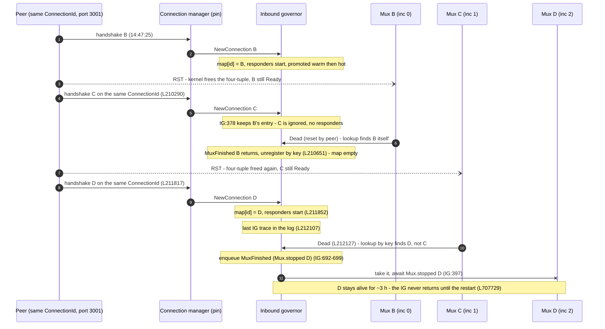
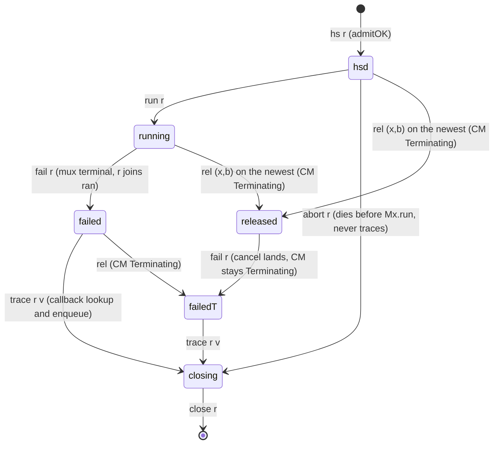
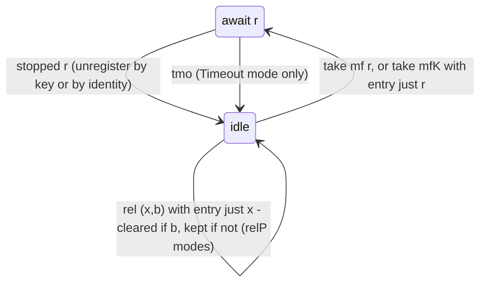
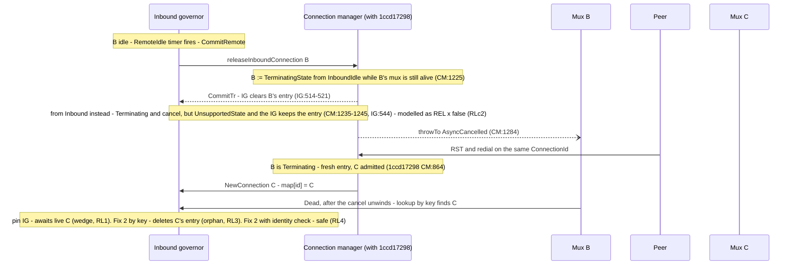
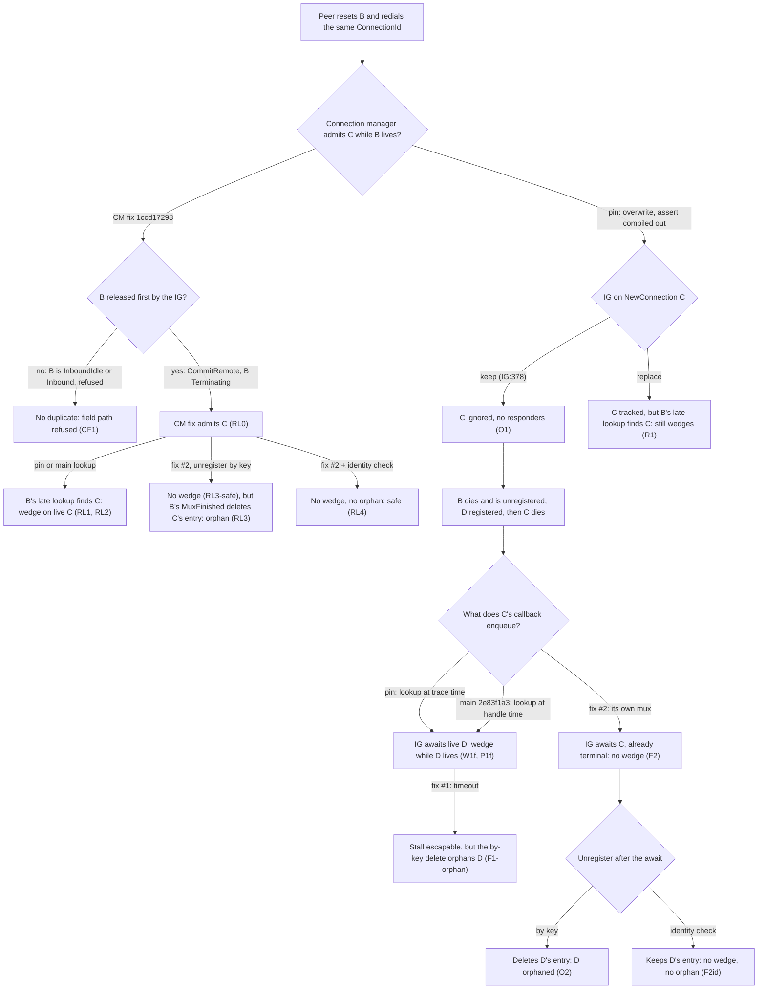
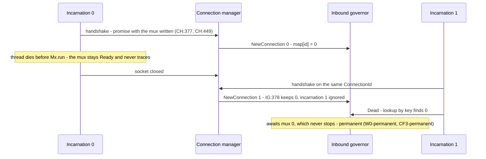

# Inbound-governor wedge: what is modelled, assumed, and proved

Design (v4.1a, current; the general atomic release): [`docs/superpowers/specs/2026-09-29-governor-wedge-release-general-design.md`](../../../../docs/superpowers/specs/2026-09-29-governor-wedge-release-general-design.md)
Design (v4; the IG's `CommitRemote` release): [`docs/superpowers/specs/2026-09-29-governor-wedge-release-design.md`](../../../../docs/superpowers/specs/2026-09-29-governor-wedge-release-design.md)
Design (v3; the connection-manager fix): [`docs/superpowers/specs/2026-09-29-governor-wedge-cmfix-design.md`](../../../../docs/superpowers/specs/2026-09-29-governor-wedge-cmfix-design.md)
Design (v2; overlapping incarnations): [`docs/superpowers/specs/2026-09-28-governor-wedge-overlap-design.md`](../../../../docs/superpowers/specs/2026-09-28-governor-wedge-overlap-design.md)
Design (v1, superseded in part; holds the citation key): [`docs/superpowers/specs/2026-09-28-governor-wedge-design.md`](../../../../docs/superpowers/specs/2026-09-28-governor-wedge-design.md)
Plans: [`docs/superpowers/plans/2026-09-28-governor-wedge-overlap.md`](../../../../docs/superpowers/plans/2026-09-28-governor-wedge-overlap.md) (v2), [`docs/superpowers/plans/2026-09-29-governor-wedge-cmfix.md`](../../../../docs/superpowers/plans/2026-09-29-governor-wedge-cmfix.md) (v3), [`docs/superpowers/plans/2026-09-29-governor-wedge-release.md`](../../../../docs/superpowers/plans/2026-09-29-governor-wedge-release.md) (v4), [`docs/superpowers/plans/2026-09-29-governor-wedge-release-general.md`](../../../../docs/superpowers/plans/2026-09-29-governor-wedge-release-general.md) (v4.1a)

## 1. What this is

John Lotoski observed a permanent stall of the `ouroboros-network` inbound
governor (IG) on the Leios prototype cluster (14 episodes, 7 of 9 relays,
104 h) and proposed two fixes. This directory is a small, standalone
CSP/ITree model of the IG's connection-management path, checked against
`ouroboros-network` pin `4b3ab7664f609a1aee0f0c24dcfcfd0ab899fc42` (also
`origin/leios-prototype`'s head). It machine-checks which interleavings
wedge the IG, how long the wedge lasts, and what each fix and each
combination of fixes does.

The headline: the wedge seen in the field is a **live replacement**. A peer
reset frees the TCP four-tuple while our mux is still alive, the peer
redials the same `ConnectionId`, the IG ignores the new incarnation
(IG:378), and a late mux callback then makes the IG await the mux of a
newer, live incarnation. The IG stays blocked as long as that incarnation
lives. The earlier (v1) model ran incarnations strictly one after another,
and so concluded that this race was closed. The field log falsifies that
sequencing, and v1's invariant N1 is withdrawn (it is false on this model;
see `notN1`).

### Citation key

Code citations are `FILE:line` at the pin above. "IG" on its own means the
inbound governor; `IG:n` means line `n` of its source file. Paths are
relative to the `ouroboros-network` repository root:

| Key | File |
|---|---|
| `IG` | `ouroboros-network/framework/lib/Ouroboros/Network/InboundGovernor.hs` |
| `State.hs` | `ouroboros-network/framework/lib/Ouroboros/Network/InboundGovernor/State.hs` |
| `InformationChannel.hs` | `ouroboros-network/framework/lib/Ouroboros/Network/InboundGovernor/InformationChannel.hs` |
| `CM` | `ouroboros-network/framework/lib/Ouroboros/Network/ConnectionManager/Core.hs` (the connection manager) |
| `CH` | `ouroboros-network/framework/lib/Ouroboros/Network/ConnectionHandler.hs` (the connection handler) |
| `Mux` | `network-mux/src/Network/Mux.hs` |
| `Diffusion.hs` | `ouroboros-network/lib/Ouroboros/Network/Diffusion.hs` |

Log citations `L<n>` are line numbers of `govstall-a1-20260927-full.log`
(control relay `leios1-rel-a-1`, unpatched, at the pin, `Net.Mux.Remote`
at Debug).

## 2. The bug path in the field

One stuck `ConnectionId`, three incarnations with overlapping lifetimes. In
the model B = incarnation 0, C = 1, D = 2.

1. **B** (thread 183027) hand-shakes, starts, and is promoted warm and hot
   by the IG. B's entry is in the IG's map.
2. The peer resets B's TCP connection. This frees the kernel four-tuple,
   but our mux is still `Ready`: it only notices on its next send or
   receive.
3. **C** (thread 183745) hand-shakes on the same `ConnectionId` **while B is
   alive** (L210290). The IG's `NewConnection` handler finds B's entry and
   keeps it (IG:378). No responder is ever started for C.
4. B dies with "Connection reset by peer" (L210651). The IG's `MuxFinished`
   handler awaits B's mux, then unregisters the entry by key (IG:406). The
   map is now empty.
5. **D** (thread 184092) hand-shakes **while C is alive** (L211817), so
   C's four-tuple was freed in turn (in the model: `reset 1`). The map is empty, so D is registered and its
   responders start (L211852).
6. The last IG trace is at L212107. C's `Dead` (L212127) is the first mux
   death after it, and the only one for the stuck key before D's own
   (L707729); the next, on another key, is ~4.7 s later (L214677). C's mux callback resolves the mux by a map lookup at
   trace time (IG:692-699), finds D's live mux, and enqueues a
   `MuxFinished` for D.
7. The IG takes that item and blocks at IG:397 on `Mux.stopped` of D. D is
   alive until the node restart (L707729), about three hours later, so the
   IG never returns.



Other facts from the log: all 5,727 handshakes reach `Starting` and
`Mature` (the v1 "never-run mux" path is not observed); C is the only
unregistered handshake among 517 before the freeze; the idle-timeout path
produced 57 demotions before the freeze, none for this key; and from about
14:51:10 dying muxes log `Dead`/`Stopped` and nothing more (the IG queue,
bound 100, is full and their tracer writes block), which accounts for the
fd growth to 1,978.

`origin/main` commit `2e83f1a3` ("Always inform IG of MuxFinished") moves
the lookup from trace time to handle time but keeps the await unbounded.
With the pin's connection manager, the same field path wedges it
(`W1fmain-reach`, `P1fmain`): `main`'s governor change alone does not fix
the wedge. The real `origin/main` also carries the connection-manager (CM)
fix `1ccd17298` ("CM: Fix connection leak"), which blocks the observed path
but not the never-run one (`CF5`, §5). Once the IG's `CommitRemote` release
is modelled (v4), the CM fix alone again waits on a live mux (`RL1`,
`RL2`), CM fix + fix #2 can orphan the live replacement (`RL3`), and CM fix
+ fix #2 + the identity check has no wedge and no orphan (`RL4`, over the
general atomic release since v4.1a, which is not every release outcome; scope in §5). Fix #2 alone still has no wedge with the
release (`RL3-safe`, `RL3-live-sys`).

## 3. What is modelled

Two processes composed with CSP parallel, synchronised on four channels:
`SysAt m c g = Conn (cmP m) c ∥⇘ syncES ⇙ Gov m g`.

- **`Conn c`**: one `ConnectionId`'s incarnations. The state is
  `cst next live ran`: the next incarnation id, the list of live
  incarnations (oldest first, each `mkInc iid iph freed` with a phase
  `hsd`/`running`/`failed`/`closing`/`released`/`failedT` and a flag saying whether a peer reset
  has freed its four-tuple), and the list of terminal muxes. Events:
  `hs r` (needs `r ≡ next` and `admitOK (cmP m)` of the live list: under
  `cmPin` every live incarnation freed, the kernel four-tuple rule; under
  `cmFix` also every live incarnation `closing`, `released` or `failedT`), `run r`, `abort r` (dies before `Mx.run`), `reset r`
  (peer reset, once, in `hsd`, `running` or `released`), `fail r` (mux terminal: `running` → `failed`, `released` → `failedT`),
  `trace r v` (the dying mux's callback, from `failed` or `failedT`), `close r`,
  `rel (x , b)` (the IG's release; the CM half acts on the **newest** live
  incarnation, not on `x`, see the table below; a released incarnation is
  `Terminating` to the CM while its mux is alive, CM:1225, CM:1236), and `stopped t` for
  terminal `t`. v1's sequential runs are the special case with no `reset`.
  The cancel that follows the release (CM:1284) is not a separate event:
  the mux's later `fail r` models the exception landing (v4 spec §3).
- **`Gov m g`**: the IG's one map entry, unbounded queue, and loop phase
  (`idle` or `await r`) fused into one process. This is faithful because
  the code touches each only through atomic STM operations. The IG still
  accepts `hs`/`trace` enqueues and answers lookups while its loop is
  blocked.
- **Synchronised channels**: `hs` (handshake + NewConnection enqueue),
  `trace` (callback lookup + enqueue), `stopped` (`Mux.stopped`), `rel`
  (the IG's `CommitRemote` release, IG:505-508, and its `CommitTr`
  unregister, IG:514-521; letter `REL x b`). `Gov` takes `rel (x , b)` only
  when idle, `relP m ≡ true` and the entry is `just x`; `b = true`
  (`CommitTr`) clears the entry, `b = false` (`UnsupportedState`, IG:544)
  keeps it (`relEntry`). It
  fires nondeterministically: the `RemoteIdle` timer and peer idleness are
  not modelled (v4 spec §3). `conn`
  (connection thread actions) and `gov` (IG actions: `promote`, `take`,
  `tmo`) are solo. All events are visible; there is no τ.
- **Modes as six switches** (`Mode` record):
  - `enqP`, what the callback of `r` enqueues after its lookup found `v`:
    `atTrace` enqueues `mf x` if `v ≡ just x` (pin, IG:692-699);
    `atHandle` enqueues a payload-free `mfK`, looked up when taken
    (`origin/main`); `own` enqueues `mf r` (fix #2).
  - `newP`, taking `nc r` when the entry is `just x`: `keep` leaves it
    (IG:378); `replace` sets `just r`.
  - `unregP`, after the await on `r` ends: `byKey` clears the entry
    (IG:406); `idChecked` clears it only if it is `just r`.
  - `timer`, whether `tmo` is offered while awaiting (fix #1; it falls
    through to the same unregister).
  - `cmP`, the connection manager's duplicate check on `hs` (v3 spec §4):
    `cmPin` admits a duplicate `ConnectionId` once every live incarnation
    is freed (the pin: overwrite, `assert False` compiled out);
    `cmFix` additionally needs every live incarnation `closing`,
    `released` or `failedT` (v4 spec §4, v4.1a spec §3; `1ccd17298`: an old entry in an established state — `Outbound*`,
    `Duplex`, `InboundIdle`, `Inbound` — is refused with
    `ForbiddenOperation`; a `Terminating`/`TerminatedState` entry gets a
    fresh one, a mid-handshake entry is overwritten, and an absent key is
    admitted, `1ccd17298` CM:864; v3 spec §2). `admitOK cmPin = allFreed`,
    `admitOK cmFix = allFreed ∧ allClosing`.
  - `relP`, whether the IG release `rel` is modelled (v4 spec §4). All ten
    earlier named modes have `relP = false` (`old-modes-norel`), so every
    v2/v3 theorem keeps its meaning: it is a result for the model without
    the release.

| Mode | enqP | newP | unregP | timer | cmP | relP |
|---|---|---|---|---|---|---|
| `AsBuilt` (the pin) | atTrace | keep | byKey | false | cmPin | false |
| `Main` (`origin/main` 2e83f1a3 on the pin's CM) | atHandle | keep | byKey | false | cmPin | false |
| `CarryMux` (fix #2) | own | keep | byKey | false | cmPin | false |
| `Timeout` (fix #1) | atTrace | keep | byKey | true | cmPin | false |
| `ReplaceEntry` | atTrace | replace | byKey | false | cmPin | false |
| `CarryMuxId` (fix #2 + identity check) | own | keep | idChecked | false | cmPin | false |
| `FullFix` | own | replace | idChecked | false | cmPin | false |
| `AsBuiltCM` (the pin + `1ccd17298`) | atTrace | keep | byKey | false | cmFix | false |
| `MainReal` (the real `origin/main`: `2e83f1a3` + `1ccd17298`) | atHandle | keep | byKey | false | cmFix | false |
| `CarryMuxCM` (`1ccd17298` + fix #2) | own | keep | byKey | false | cmFix | false |
| `AsBuiltCMR` (the leios branch + `1ccd17298`, with the release) | atTrace | keep | byKey | false | cmFix | true |
| `MainRealR` (the real `origin/main`, with the release) | atHandle | keep | byKey | false | cmFix | true |
| `CarryMuxCMR` (`1ccd17298` + fix #2, with the release) | own | keep | byKey | false | cmFix | true |
| `CarryMuxIdCMR` (`1ccd17298` + fix #2 + identity check, with the release) | own | keep | idChecked | false | cmFix | true |

**The general release (v4.1a spec §3).** The code resolves a release by
`ConnectionId` (CM:1145), so after duplicate admissions it hits the
**newest** incarnation, not necessarily the IG's entry. In the model
`newest (live c)` is the last live incarnation, and `cstep` on `rel (x , b)`
ignores `x` and applies `relLive b (newest is) is`. `b` is `CommitTr`
(`true`, from `InboundIdle`) or `UnsupportedState` (`false`, from `Inbound`,
CM:1235-1245); responder activity is not modelled, so the choice is
nondeterministic (an over-approximation, sound for every-run claims). The
code treats a release from `InboundState` as unexpected: besides
`UnsupportedState` it emits `TrUnexpectedlyFalseAssertion` and runs
`evaluate (assert False)` (CM:1241, CM:1289); the model keeps it as the
`b = false` column.

| Newest live incarnation `y` | `REL x true` (CommitTr) | `REL x false` (UnsupportedState) |
|---|---|---|
| `hsd` or `running` | `y` → `released`; IG entry cleared | `y` → `released`; IG entry kept |
| `failed` | `y` → `failedT`; IG entry cleared | `y` → `failedT`; IG entry kept |
| `released`, `failedT`, `closing`, or none | no CM change (entry-only clear, CM:1146-1153, CM:1264-1269); IG entry cleared | refused |

The IG side needs `x` to be its entry in every row. `failedT` is a
failed-not-cleaned incarnation the CM sees `Terminating`, reached by a
release of a `failed` one or by the `fail` of a `released` one (the cancel
landing; the cleanup keeps a `TerminatingState` through time-wait,
CM:636-637, `1ccd17298` CM:637-638): its mux is
terminal (`r ∈ ran`), `trace r v` still takes it to `closing`,
`admitOK cmFix` accepts it, and `LiveMux` excludes it. Tests in
`Model.agda`: `rel-commit-conn`, `rel-commit-gov`, `rel-unsup-gov`,
`rel-newest`, `rel-entry-only`, `rel-unsup-refused`, `rel-failed`,
`admit-fix-failedT`, `admit-fix-released`, `fail-released` (released →
`failedT`), `rel-newest-closing-commit`, `rel-newest-closing-unsup` (the
last two on a state unreachable under `cmFix`: unit tests of `relLive`),
`rel-gov-off`.

One incarnation's life in `Conn` (a `reset r`, the peer's RST, can happen in
`hsd`, `running` or `released` and only sets the `freed` flag):



The IG loop in `Gov` (`hs` and `trace` enqueue in both phases):



Derived notions (`Model.agda`): `LiveRun c r` (r live in `hsd` or
`running`, freed or not: a reset mux has not yet noticed); `LiveMux c r`
(live in `hsd`, `running` or `released`: a released mux is still
`Ready`; a `failedT` mux is dead); `Active c r`
(`hsd` or `running` and not freed; at most one exists; a released
incarnation is not active); `OrphanStep` (`Steps.agda`:
a composite step that changes the entry from `just x` while `x` is
active); `OrphanStepR` (`Steps.agda`: an `OrphanStep` whose channel is not
`rel`; the release is the IG's deliberate teardown, so dropping the entry
there is intended); `Tracked c g` (idle, empty queue, and every active incarnation is
the entry).

**Architecture.** `Conn` and `Gov` are each generated from a pure step
function (`cstep`, `gstep` in `Model.agda`). `Steps.agda` proves the
composite moves exactly by `sstep` (`Sys-step-inv`/`Sys-step-intro`,
`run-inv`/`run-intro`), so every theorem is an induction or a `refl` chain
over the pure `Steps` relation, never a CSP-operator-level simulation.

## 4. Assumptions and simplifications

### (a) Premises of the observed path

The model shows these premises *suffice* to reach the wedge; the log shows
they occurred once, on one key.

1. A peer reset frees the four-tuple while our mux is still alive (L210651
   records B noticing the reset only later).
2. The peer redials the same `ConnectionId` (C at L210290, D at L211817).
3. The IG keeps the old entry (IG:378), so the replacement is ignored.
4. The old incarnation (C) dies after the replacement's replacement (D)
   registers (L211852 before L212127), so C's lookup finds D.

### (b) Modelling simplifications (v2 spec §3, v1 spec §3-§4)

- **One `ConnectionId`.** Independent keys don't interact; the bug needs
  one.
- **Untimed.** Fix #1's timeout is the visible `tmo` event, enabled
  whenever the loop awaits. `F1-live`/`F1-live-sys` say the stall is
  always *escapable*, never that it resolves within a bound.
- **No batching.** One queued event at a time; a blocked handler stalls
  the loop either way.
- **Warm/Hot promotion elided**: `promote` stands for any IG progress.
- **The `RemoteIdle` → `CommitRemote` idle-timeout path is untimed.** In
  the log it never fired for this key. Once the loop is blocked at IG:397
  it cannot fire regardless (it comes only from the gather step). v4
  models its release step as `rel` (relP modes only): it may fire whenever
  the IG is idle and holds an entry (since v4.1a the CM half then acts on
  the newest live incarnation, §3); the timer and peer idleness are not
  modelled (v4 spec §3).
- **Unbounded queue.** The code's queue holds 100. The bound explains the
  post-freeze fd growth, not the wedge.
- **`hs` is atomic** (promise write + CM enqueue as one step); in the code
  the enqueue can lag or be skipped when the dying handler's cleanup wins
  (CM:991-995). Marked `ponytail:` in `Model.agda`; the upgrade path is a
  separate CM process per incarnation.
- **No reset after failure.** `reset` (`freeIt`) frees only incarnations in
  `hsd`/`running`/`released`, not `failed`/`failedT`/`closing`, although a real peer can RST a
  failed-but-unclosed socket. Hence admission over a `failedT` incarnation
  needs it reset before its mux failed (`RLc3`). So the every-run theorems cover fewer
  interleavings than reality; the extra ones are believed harmless for
  F2/F2id/FIX/RL4 but not proved.
- **`cmFix` versus the code** (v3 spec §2-§3). The model admits a
  duplicate once every live incarnation is `closing` (traced or aborted).
  On the modelled paths the code refuses it until the connection thread's
  cleanup has written `TerminatedState` and purged the key (CM:608, and
  one `modifyTMVar` at `1ccd17298`), later. `TerminatingState` is not
  written by the cleanup but by the IG's `CommitRemote` release (CM:1224-1240)
  and the outbound demotion timeout (CM:2038), while the mux is still
  alive. v2/v3 omit both, so CF2 and CF4 are results for the model without
  them (`relP = false`); the refusal CF1 is unaffected. The inbound release
  is now modelled (v4: `rel`, `released`, `relP`; RL1-RL4, §5), and with it
  the conclusions of CF2 and `CF4-no-orphan` fail (RL1, RL3). CM fix +
  fix #2 + identity check has both (RL4); fix #2 gives no-wedge
  (RL3-safe), the identity check gives no-orphan; CF2 for
  `AsBuiltCMR`/`MainRealR` is not restored (RL1). Only the outbound demotion timeout (CM:2038) remains
  unmodelled.
- **The release path (modelled, v4; module `Release`).** B registered and
  `InboundIdle`; its idle timer leads to `CommitRemote`, which writes B
  `TerminatingState` and cancels its thread (CM:1225, CM:1284), and the IG
  clears the entry on `CommitTr` (IG:514-521): in the model, `REL 0 true`. (From
  `InboundState` the CM also writes `TerminatingState` and cancels,
  CM:1235-1245, but returns `UnsupportedState`, so the IG keeps the entry,
  IG:544; modelled since v4.1a as `REL x false`, `RLc2`.) The
  peer resets and redials (`reset 0`, `hs 1`); the fixed CM gives C a fresh
  entry because B's is `TerminatingState` (`1ccd17298` CM:864), and in the
  model `hs 1` is admitted because B is `released` and freed (RL0); C registers. B's
  cancelled mux then fails and traces `Dead` (Mux:274-276; `fail 0`,
  `trace 0 (just 1)`), and its lookup (IG:692-699) finds live C. Under
  `AsBuiltCMR`/`MainRealR` the IG awaits live C (RL1, RL1main) and never
  promotes while C does not fail (RL2, RL2main). Under `CarryMuxCMR` B's own
  `MuxFinished` makes the IG await terminal mux 0, and its `stopped 0`
  unregisters by key and orphans active C (RL3), though it still has no
  wedge (RL3-safe, RL3-live-sys). Under `CarryMuxIdCMR`
  (identity check added) every awaited mux is terminal, promote is always
  reachable within two steps, and no step other than the release itself
  orphans an active entry, over every run (RL4; the release step itself
  does orphan, `rel-orphans`). RL1/RL3 need C registered
  before B's cancelled mux traces; the model is untimed, so it says that
  interleaving exists, not how likely it is.



Modelled: RL1, RL3; identity check safe: RL4. The model's letters are
`wRel = hs 0 · take · run 0 · REL 0 true · reset 0 · hs 1 · take · run 1 · fail 0 · trace 0 (just 1) · take`;
the release and `CommitTr` are one `REL 0 true` step, and the cancel landing is
`fail 0` (B `released` → `failedT`, then traced to `closing`).
- **Outbound demotion timeout not modelled.** It writes `TerminatingState`
  (CM:2038) and then cancels the thread (CM:2048), the same shape as the
  release; it is an outbound path, and the inbound release suffices to
  decide which fixes survive (v4 spec §2). Open residual.
- **Mid-handshake overwrite not modelled.** `1ccd17298` still overwrites
  an entry in `UnnegotiatedState` or `ReservedOutboundState`. The model's
  `hs` is a completed handshake, so a duplicate arriving while the old
  connection is still mid-handshake is outside the model.

## 5. What is proved

### The fixes at a glance

Where each fix intervenes: at admission of the duplicate (connection
manager, IG:378), or at the dying mux's callback (the stuck key's entry is
the live D when C dies). Box labels name the theorems below. The release
branch (v4): if the IG released B first, the CM fix admits C.



The never-run path W0: reachable in the model and permanent, but never
observed in the log (0 of 5,727 handshakes), and not blocked by the CM fix
because its incarnations are strictly sequential (CF3).



Module paths are relative to `src/CSP/Examples/GovernorWedge/`.
"One run" = a concrete `Steps` witness; "every run" = over all states
reachable from `(c₀, g₀)` (`Reach m c g`). Rows W1f-O1 follow v2 spec §5;
rows CF1-CF5 follow v3 spec §5, and CF2-CF5 are results without the release
(`relP = false`); CF1 is over every `cmFix` mode, so it holds with the
release too. Rows RL0-RL4 follow v4 spec §5; since v4.1a they are over the
general release (v4.1a spec §4), whose controls RLc1-RLc3 are in the table below.

| Row | Agda name(s) | Module | Exact scope |
|---|---|---|---|
| W1f: the field path reaches waiting on live D | `W1f-reach`, `W1f-trace`, `W1fmain-reach`, `W1fT-reach` | `FieldPath` | `Steps AsBuilt c₀ g₀ wF cF gF` (18 letters); `traces (Sys AsBuilt) wF`; the same run under `Main` and `Timeout`. End state: `gF = gst (just 2) [] (await 2)`, D running and un-freed. |
| P1f: the wedge lasts while D lives | `P1f`, `P1fmain` | `Wedged` | `SysAt AsBuilt cF gF ⟹⟨ s ⟩ W′ → All (_≢ CN (fail 2)) s → All (_≢ GV promote) s` (and for `Main`): every continuation without D's `fail` has no `promote`. Via `Blocked`/`blocked-until`. |
| H1f: if D fails the IG resumes | `H1f` | `FieldPath` | `Steps AsBuilt c₀ g₀ (wF ++ fail 2 · stopped 2 · promote) …` ending with the IG idle and the entry cleared. |
| W0: the never-run path wedges forever | `W0-reach`, `W0-trace`, `W0main-reach`; `W0-permanent`, `W0main-permanent` | `Witness`; `Wedged` | `Steps AsBuilt c₀ g₀ w0 cW0 gW0` (10 letters, incarnation 0 aborts before `Mx.run`); at `(cW0, gW0)`, `All (_≢ GV promote) s` for every continuation `s`, no side condition (via `Dead`: mux 0 can never become terminal). Same for `Main`. |
| ¬N1: a reachable state waits on a live mux | `notN1` | `FieldPath` | `Σ s. Steps AsBuilt c₀ g₀ s cF gF × gphase gF ≡ await 2 × 2 ∉ ran cF × LiveRun cF 2`. |
| F2: fix #2 removes the wedge | `F2-safe`, `F2-live`, `F2-live-sys` | `Invariant` | `Reach CarryMux c g → gphase g ≡ await r → r ∈ ran c`; from every reachable state `promote` or `stopped r · promote` is a trace (model level and process level). Over any number of overlapping incarnations. |
| O2: fix #2 alone orphans D | `O2` | `FieldPath` | `Steps CarryMux c₀ g₀ wF cF gFC × OrphanStep CarryMux cF gFC stopped 1`: C's own item makes the IG await 1, and `stopped 1` deletes D's entry while D is active. |
| F2id: fix #2 + identity check | `F2id-safe`, `F2id-live-sys`, `F2id-no-orphan` | `Invariant` | F2's safety and process-level liveness under `CarryMuxId`, and `Reach CarryMuxId c g → ¬ OrphanStep CarryMuxId c g at a` for every step. |
| R1: `replace` alone re-creates the wedge | `R1` | `FieldPath` | `Steps ReplaceEntry c₀ g₀ wR cR gR × 1 ∉ ran cR × Active cR 1`: C is now the entry, B's late lookup finds C, and the IG awaits live C. |
| FIX: all fixes combined | `FIX-safe`, `FIX-live-sys`, `FIX-no-orphan`, `FIX-tracked` | `FullFix` | Under `FullFix`, over every reachable state: every awaited mux is terminal; `promote` or `stopped r · promote` is a trace; no orphaning step; `gphase g ≡ idle → queue g ≡ [] → Tracked c g`. |
| F1: fix #1 escapes by construction, and orphans D | `F1-live`, `F1-live-sys`, `F1-orphan` | `Timeout` | `F1-live` holds for *every* model state (no `Reach`): `promote` or `tmo · promote` is a `Steps Timeout` run; `F1-live-sys` at process level. `F1-orphan : Steps Timeout c₀ g₀ wF cF gF × OrphanStep Timeout cF gF gov tmo`: on the field path the timeout clears D's entry by key while D is active. |
| O1: the replacement is ignored | `O1` | `FieldPath` | `∀ m → newP m ≡ keep → cmP m ≡ cmPin → Steps m c₀ g₀ oF cO gO × Active cO 1 × entry gO ≢ just 1`: every keep-policy mode on the pin's CM (AsBuilt, Main, CarryMux, Timeout, CarryMuxId) reaches an idle state where active C is not the entry. The `cmPin` premise is new in v3: under `cmFix` the handshake `hs 1` that `oF` needs is refused (CF1). |
| CF1: the CM fix refuses the field path | `CF1`, `CF1-trace` | `CMFix` | One step. `∀ m → cmP m ≡ cmFix → Steps m c₀ g₀ cf-prefix cF4 gF4 × sstep (ℕ , hs) 1 m cF4 gF4 ≡ nothing`, with `cf-prefix = hs 0 · take · run 0 · reset 0`: after the prefix, C's handshake is refused. Hence `¬ traces (Sys m) wF` for every such mode (via `steps-det`). |
| CF2: under the CM fix the IG never waits on a live mux | `CF2`, `CF2main` | `CMFix` | Every run. `Reach AsBuiltCM c g → gphase g ≡ await r → ¬ LiveRun c r`, and the same for `MainReal`. Via the invariant `CMI` (at most one live incarnation not `closing`, none `released`, plus a FIFO order on the IG's items) over `CMMode ep = mode ep keep byKey false cmFix false`. Ramsay Taylor's `SysFix` invariant in the form that holds, without the release; with it, RL1. |
| CF3: the never-run path still wedges forever under the CM fix | `CF3-reach`, `CF3main-reach`; `CF3-permanent`, `CF3main-permanent` | `CMFix` | One run + every run. `Steps AsBuiltCM c₀ g₀ w0 cW0 gW0` (and for `MainReal`): `w0` runs its incarnations strictly in sequence, so the CM fix never triggers. From `(cW0, gW0)`, `All (_≢ GV promote) s` for every continuation `s` (the awaited mux 0 is dead, not live, so this is consistent with CF2). |
| CF4: CM fix + fix #2, no wedge and no orphan, without the identity check (modelled paths) | `CF4-safe`, `CF4-live-sys`, `CF4-no-orphan` | `CMFix` | Every run, under `CarryMuxCM` (unregister `byKey`): `Reach CarryMuxCM c g → gphase g ≡ await r → r ∈ ran c`; from every reachable process state `promote` or `stopped r · promote` is a trace; `Reach CarryMuxCM c g → ¬ OrphanStep CarryMuxCM c g at a` for every step. `CF4-safe`/`CF4-live-sys` already follow from fix #2 alone (F2); only `CF4-no-orphan` needs the CM fix, and only without the release (with it, RL3). |
| CF5: the real `main` | `CF5` | `CMFix` | Corollary. `¬ traces (Sys MainReal) wF × traces (Sys MainReal) w0`: the real `origin/main` refuses the observed field path (CF1) but still has the never-run wedge (CF3). |
| RL0: the release fires and the CM fix then admits C | `RL0` | `Release` | One run (control). `Steps AsBuiltCMR c₀ g₀ (hs 0 · take · run 0 · REL 0 true · reset 0 · hs 1) (cst 2 (mkInc 0 released true ∷ mkInc 1 hsd false ∷ []) []) (gst nothing (nc 1 ∷ []) idle)`: the release clears B's entry, the peer reset frees B's four-tuple while its mux is alive, and `hs 1` is admitted under `cmFix` because B is `released`. |
| RL1: with the release, the CM fix waits on live C | `RL1`, `RL1main`, `RL1-trace` | `Release` | One run. `Steps AsBuiltCMR c₀ g₀ wRel cR1 gR1 × gphase gR1 ≡ await 1 × 1 ∉ ran cR1 × LiveRun cR1 1`, and the same for `MainRealR`; `RL1-trace : traces (Sys AsBuiltCMR) wRel`. `wRel` (11 letters) as in §4(b); `cR1 = cst 2 (mkInc 0 closing true ∷ mkInc 1 running false ∷ []) (0 ∷ [])`, `gR1 = gst (just 1) [] (await 1)`. CF2's conclusion fails once the release is modelled. |
| RL2: the release wedge lasts while C lives | `RL2`, `RL2main` | `Release` | Every run from RL1. `SysAt AsBuiltCMR cR1 gR1 ⟹⟨ s ⟩ W′ → All (_≢ CN (fail 1)) s → All (_≢ GV promote) s`, and the same for `MainRealR`. Via `Blocked`/`blocked-until`. |
| RL3: with the release, CM fix + fix #2 orphans C, but still has no wedge | `RL3`; `RL3-safe`, `RL3-live-sys` | `Release` | One run. `Steps CarryMuxCMR c₀ g₀ wRel cR1 gR3 × OrphanStepR CarryMuxCMR cR1 gR3 (ℕ , stopped) 0`, `gR3 = gst (just 1) [] (await 0)`: B's own item makes the IG await terminal mux 0, and `stopped 0` deletes C's entry while C is active. `CF4-no-orphan`'s conclusion fails once the release is modelled. Every run, under `CarryMuxCMR`: `RL3-safe : Reach CarryMuxCMR c g → gphase g ≡ await r → r ∈ ran c` and `RL3-live-sys` (promote or `stopped r · promote` from every reachable process state): fix #2 alone keeps no-wedge with the release. |
| RL4: CM fix + fix #2 + identity check survives the release | `RL4-safe`, `RL4-live-sys`, `RL4-no-orphan` | `Release` | Every run, under `CarryMuxIdCMR`: `Reach CarryMuxIdCMR c g → gphase g ≡ await r → r ∈ ran c`; from every reachable process state `promote` or `stopped r · promote` is a trace; `Reach CarryMuxIdCMR c g → ¬ OrphanStepR CarryMuxIdCMR c g at a` for every step (via `keeps-entryR`). The release step itself drops an active entry by design and is excluded by `OrphanStepR`; `rel-orphans : OrphanStep CarryMuxIdCMR (cst 1 (mkInc 0 running false ∷ []) []) (gst (just 0) [] idle) ((ℕ × Bool) , rel) (0 , true)` shows the exclusion is load-bearing. Scope (v4.1a): the release is the general atomic one, and RL4 covers these outcomes of it: resolution by `ConnectionId` (the newest incarnation; CM:1145, and a duplicate over `Terminating` is admitted and inserted, `1ccd17298` CM:864/878), release from `hsd` (IG:355-358), entry-only clears (CM:1146-1153, CM:1264-1269), `InboundState`'s `UnsupportedState` (CM:1235-1245, IG:544), and release of a failed-not-cleaned incarnation (`failedT`). Still not covered: the non-atomic order (the CM's `throwTo`, CM:1284, precedes the IG's unregister, IG:520; planned v4.1b), the outbound demotion timeout (CM:2038), the `UnnegotiatedState`/`ReservedOutboundState` overwrite, timing, and duplex/outbound reuse of the inbound connection (`DuplexState`, `OutboundDupState`, `OutboundIdleState`, `KeepTr`; CM:1180-1216, CM:1249-1259, IG:540-542), which is not modelled: all but `OutboundIdle` leave the model's state unchanged (the IG keeps its entry, or only touches the unmodelled `RemoteState`), so they add no reachable model state; `OutboundIdle` clears the entry while the connection stays established and is uncovered (reachable only through duplex/outbound reuse). The other `UnsupportedState` outcomes (`ReservedOutbound`/`Unnegotiated`, `OutboundUni`, `Terminated`; CM:1163-1174, CM:1199-1205, CM:1273-1278) change neither the CM nor the IG entry: a stutter the model omits. |

Finding (`FullFix.take-nc-absurd`): under FullFix, `replace` never meets
an active entry. The `hs` guard frees every live incarnation before the
next `NewConnection` is enqueued, so the entry `replace` overwrites is
always freed or terminal. What prevents orphans is the identity check;
what `replace` buys is tracking the replacement (O1).
This relies on the `hs`-atomicity ceiling of §4(b) (summary S5: handshake
and `NewConnection` enqueue are one step; in the code the enqueue is a
separate `atomically`, CM:1016-1018). If enqueues can reorder, the queue can
hold `nc 2 · nc 1`, `replace` then installs stale C while D is active (an
orphaning step), and `keep` cannot; CarryMuxId (`keep` + identity check) is
then the safer choice, at the cost of O1.

**Non-vacuity controls:**

| Control | Agda name | Module | What it rules out |
|---|---|---|---|
| `promote` is offered at the start | `promote₀` | `Witness` | The refusals in P1f/W0 being trivial. |
| An await on a terminal mux is reachable, per mode | `N1-ctrl-ran` (AsBuilt), `F2-ctrl` (CarryMux: after `w0` it awaits terminal mux 1), `clean-CarryMuxId`, `clean-FullFix` | `Witness` | F2 (`F2-ctrl`), F2id (`clean-CarryMuxId`) and FIX (`clean-FullFix`) safety stated over an empty set of awaits. |
| Fix #2 changes the outcome of the W0 prefix, not its reachability | `F2-ctrl` | `Witness` | F2 vacuously safe because the wedge trace is unreachable under `CarryMux`. |
| The Timeout mode reaches the W0 await | `W0T-reach` | `Witness` | F1 escaping a stall that was never entered. |
| F1's escape is the real W0 stall | `F1-ctrl` (via `Steps-++`) | `Timeout` | `traces (Sys Timeout) (w0 ∷ʳ tmo ∷ʳ promote)`. |
| After the timeout on W0 the next incarnation is tracked | `F1-heal` | `Timeout` | `w0 ++ tmo · close 1 · hs 2 · take` ends with entry `just 2`, idle, empty queue. |
| O2's and F1's orphan steps start from the real field wedge | `O2`, `F1-orphan` first components | `FieldPath`, `Timeout` | An orphan exhibited only from an unreachable state. |
| Under the CM fix the IG does await | `CF3-reach`, `CF3main-reach` | `CMFix` | CF2 stated over an empty set of awaits. |
| Under `CarryMuxCM` an await (on terminal mux 0) is reachable | `clean-CarryMuxCM` | `CMFix` | CF4 safety stated over an empty set of awaits. |
| The release is enabled and the CM fix then admits C | `RL0` | `Release` | RL1/RL3 resting on a step the model refuses. |
| Under `CarryMuxIdCMR` the release interleaving and RL3's step `stopped 0` are reachable, and C's entry is kept while C is active | `RL4-ctrl` | `Release` | RL4-no-orphan holding only because RL3's orphaning step is unreachable under the identity check. `Steps CarryMuxIdCMR c₀ g₀ (wRel ∷ʳ stopped 0) cR1 (gst (just 1) [] idle) × Active cR1 1`. |
| The release step is itself an orphaning step | `rel-orphans` | `Release` | RL4-no-orphan holding only because `OrphanStepR` excludes nothing that occurs. `OrphanStep CarryMuxIdCMR (cst 1 (mkInc 0 running false ∷ []) []) (gst (just 0) [] idle) ((ℕ × Bool) , rel) (0 , true)`. |
| A by-id mismatch is reachable under `CarryMuxIdCMR` | `RLc1` (letters `wRc1`) | `Release` | RL4 holding only because the release never hits an incarnation other than the IG's entry. `wRc1 = hs 0 · take · run 0 · reset 0 · fail 0 · REL 0 false · hs 1 · take · run 1 · REL 0 true`: B fails and is marked `failedT` with its entry kept, C is admitted over it and ignored (`keep`), and the IG's release of its stale entry B terminates the newest, C. End: `cst 2 (mkInc 0 failedT true ∷ mkInc 1 released false ∷ []) (0 ∷ [])`, `gst nothing [] idle`. Observation: a release aimed at a stale entry cancels the newest, healthy incarnation. Its first release (`REL 0 false` on failed-not-cleaned B) hits the CM's `InboundState`, which the code treats as unexpected (`TrUnexpectedlyFalseAssertion`, `evaluate (assert False)`, CM:1241, CM:1289), so RLc1 passes through an asserted-unexpected CM state; `RLc1′` is the reportable witness. |
| The same side effect with `CommitTr` only | `RLc1′` (letters `wRc1′`) | `Release` | The by-id mismatch needing an asserted-unexpected CM state. `wRc1′ = hs 0 · take · run 0 · reset 0 · fail 0 · trace 0 (just 0) · hs 1 · run 1 · REL 0 true`: B fails and is traced (`closing`), C is admitted and runs, and the IG, whose `CommitRemote` is served before its queued messages (IG:258-266), releases its stale entry B while the CM cancels the newest, C. End: `cst 2 (mkInc 0 closing true ∷ mkInc 1 released false ∷ []) (0 ∷ [])`, `gst nothing (mf 0 ∷ nc 1 ∷ []) idle`. Observation (no assertion path): a release aimed at a stale entry cancels the newest, healthy incarnation. Not a wedge or an orphan, but a code-level side effect the fixes do not address, worth reporting. |
| `UnsupportedState` is reachable | `RLc2` | `Release` | The `b = false` outcome never occurring. `hs 0 · take · run 0 · REL 0 false` ends with B `released` and the entry `just 0` kept: `cst 1 (mkInc 0 released false ∷ []) []`, `gst (just 0) [] idle`. |
| Admission over `failedT` is reachable | `RLc3` | `Release` | The `failedT` admission case never occurring. RLc1's prefix up to `hs 1` is admitted under `cmFix`: `cst 2 (mkInc 0 failedT true ∷ mkInc 1 hsd false ∷ []) (0 ∷ [])`, `gst (just 0) (nc 1 ∷ []) idle`. |

## 6. What is NOT proved

- The never-run path W0 is reachable in the model but **not observed**:
  0 of 5,727 handshakes in the log fail to reach `Starting`/`Mature`.
- P1f is conditional on D not failing. In the log D outlived the whole
  window (L707729), so the log neither confirms nor refutes the self-heal
  H1f.
- Anything about timing, rates, or episode frequency: the model is
  untimed throughout, including the `Timeout` mode's `tmo`, which is a
  visible choice, not a deadline.
- That the premises in §4(a) are common: the log shows them once, on one
  key; nothing here is evidence about probability.
- The `RemoteIdle` timer and peer idleness (the release is modelled
  untimed, as "may fire"), the outbound demotion timeout (CM:2038) and the
  queue bound are out of scope. The queue bound explains the post-freeze fd
  growth, not the wedge.
- How likely the release interleaving is: RL1/RL3 need C registered before
  B's cancelled mux traces, a window the source does not bound; the model
  says the interleaving exists, not how often.
- The code-level consequence of O1 that IG:325 never starts the ignored
  replacement's responders: the model has no responders.
- Everything scoped out in v2 spec §3: multiple `ConnectionId`s, batching,
  Warm/Hot promotion detail, mini-protocols, and the `hs`/CM enqueue
  atomicity ceiling.
- Anything about the `UnnegotiatedState`/`ReservedOutboundState` overwrite
  that `1ccd17298` keeps (a duplicate arriving mid-handshake): outside the
  model (v3 spec §3).
- That `cmFix` is exactly the code's check, or that CF2 and CF4 hold for
  every code interleaving: they hold for the model without the release,
  and fail with it (RL1, RL3). RL4 (CM fix + fix #2 + identity check) holds
  with the release, for the modelled atomic release outcomes (scope below);
  the outbound demotion timeout is not modelled. CF1 is unaffected.
- The CM fix alone does **not** remove the never-run wedge (CF3; not
  observed in the log). Only binding the mux identity (fix #2) removes it.
  With both (CF4) there is no wedge and no orphan in any interleaving the
  model allows without the release; with the release the identity check
  is also needed (RL3, RL4). This is the code-level recommendation: CM fix
  + fix #2 + identity check (RL4). Fix #2 alone has no wedge with the
  release (RL3-safe, RL3-live-sys); the identity check is needed only
  against the orphan (RL3 vs RL4).
- That RL4 holds for the code's release in full. Since v4.1a RL4 covers these atomic release outcomes: resolution by `ConnectionId` (the newest incarnation), release from `hsd`, entry-only clears, `InboundState`'s `UnsupportedState`, and release of a failed-not-cleaned incarnation. Still not covered: the non-atomic order (the CM's `throwTo`, CM:1284, precedes the IG's unregister, IG:520; planned v4.1b), the outbound demotion timeout (CM:2038), the `UnnegotiatedState`/`ReservedOutboundState` overwrite, timing, and duplex/outbound reuse of the inbound connection (`DuplexState`, `OutboundDupState`, `OutboundIdleState`, `KeepTr`; CM:1180-1216, CM:1249-1259, IG:540-542), which is not modelled: all but `OutboundIdle` leave the model's state unchanged (the IG keeps its entry, or only touches the unmodelled `RemoteState`), so they add no reachable model state; `OutboundIdle` clears the entry while the connection stays established and is uncovered (reachable only through duplex/outbound reuse). The other `UnsupportedState` outcomes (`ReservedOutbound`/`Unnegotiated`, `OutboundUni`, `Terminated`; CM:1163-1174, CM:1199-1205, CM:1273-1278) change neither the CM nor the IG entry: a stutter the model omits.
- That the fixes stop a release aimed at a stale entry from cancelling the newest, healthy incarnation (`RLc1′`, and `RLc1` through an asserted-unexpected CM state): they do not; it is neither a wedge nor an orphan.
- That every active incarnation is tracked under RL4: `RL4-no-orphan` says no non-release step drops an active entry, not that an active incarnation has one (under `keep`, RLc3's continuation can leave C active with entry `nothing`); tracking is FIX's `Tracked` (`FIX-tracked`), not RL4.

## 7. How to check

From `src/` (run agda in its own memory-capped cgroup):

```
agda CSP/Examples/GovernorWedge/Timeout.agda
agda CSP/Examples/GovernorWedge/Wedged.agda
agda CSP/Examples/GovernorWedge/Invariant.agda
agda CSP/Examples/GovernorWedge/FullFix.agda
agda CSP/Examples/GovernorWedge/CMFix.agda
agda CSP/Examples/GovernorWedge/Release.agda
```

Between them, all ten modules (`Model`, `Steps`, `Witness`, `FieldPath`,
`Wedged`, `Invariant`, `FullFix`, `Timeout`, `CMFix`, `Release`) are reached as imports
and checked. Verify against the literal `Checking …` line Agda prints for
each module, not exit code alone. None of the ten contains a `postulate`,
`NON_TERMINATING`, or hole. Expect seconds to minutes and a few GB of
memory.
